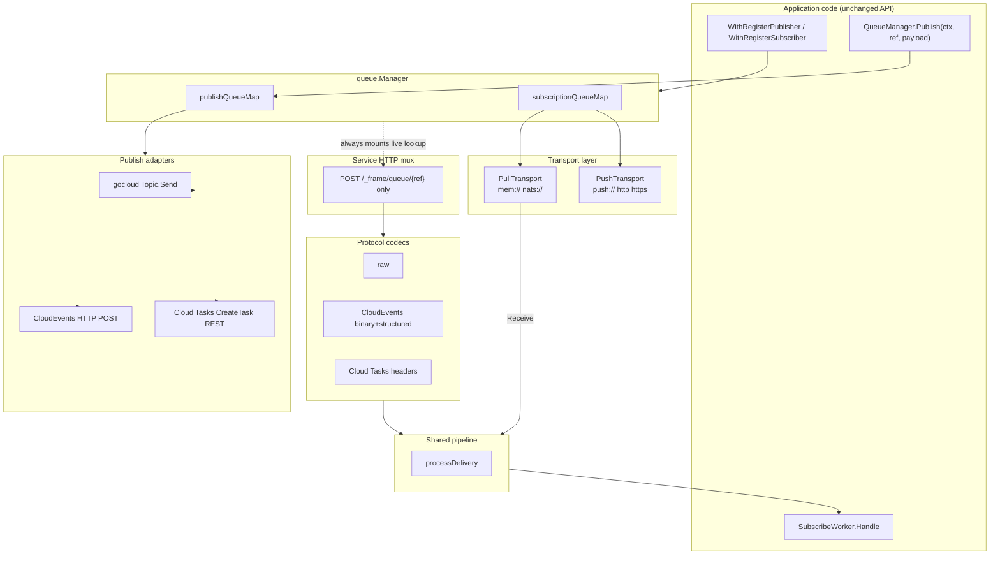
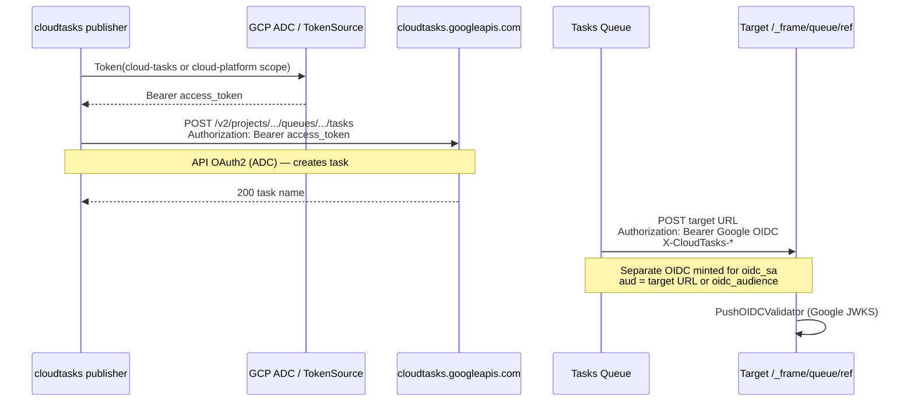
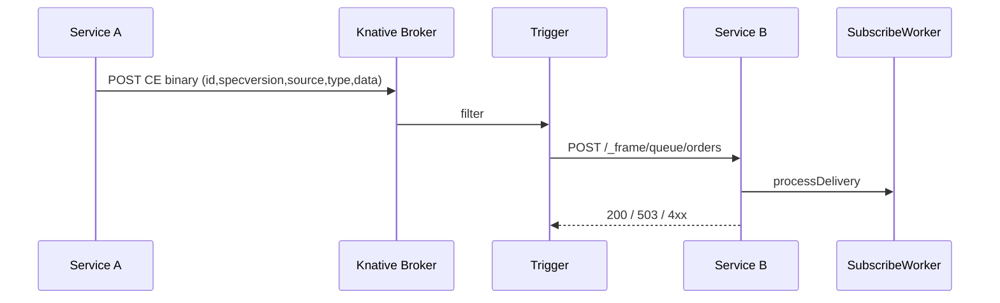
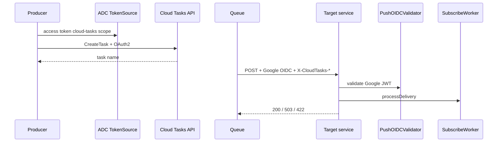

# Queue Transport Multiplexing for Knative Events + Cloud Tasks

| Field | Value |
|-------|-------|
| **Document** | Queue Transport Multiplexing (Knative Events + Cloud Tasks) |
| **Author** | Frame maintainers (design draft) |
| **Date** | 2026-07-20 |
| **Status** | Draft (revised after design review) |
| **Module** | `github.com/pitabwire/frame/v2` |
| **Primary package** | `queue/` |
| **Audience** | Senior engineers implementing / reviewing Frame core changes |

---

## Overview

Frame’s queue package today is a Go Cloud Pub/Sub wrapper optimized for **pull** transports (`mem://`, `nats://`). Application code registers named publishers/subscribers and processes messages through `SubscribeWorker.Handle`. A latent hook already skips `OpenSubscription` and the pull loop when a subscriber URL has an `http` prefix, but **no HTTP receiver, protocol adapters, or publisher equivalents exist**.

This design adds a **transport multiplexing layer** so the same application registration API works across:

| Mode | Publish | Subscribe |
|------|---------|-----------|
| Local | `mem://` / `nats://` OpenTopic | pull Receive loop |
| NATS / prod pull | `nats://` | pull Receive loop |
| Knative Eventing | HTTP POST CloudEvents | HTTP push receiver (CloudEvents) |
| Cloud Tasks | Create HTTP task targeting the service | HTTP push handler (task request) |

Mode selection is **URL-scheme / config driven**. Handlers stay `SubscribeWorker`. A single Frame-owned HTTP entrypoint demultiplexes by **registration reference** (path segment) into the **same processing pipeline** used by pull (context enrichment policy, metrics, workerpool backpressure, Ack/Nack → HTTP status).

Local development remains unchanged. Knative / Cloud Tasks deployment is a URL + Trigger / queue config change, not a handler rewrite. Cluster objects (Broker, Trigger, Cloud Tasks queue IAM) remain an ops concern (Non-Goal to auto-provision).

---

## Background & Motivation

### Current state (verified in tree)

**Queue manager** (`queue/manager.go`, `queue/interface.go`):

- `Manager`: `AddPublisher`, `AddSubscriber`, `Publish`, `Init`, `Close`
- Registration options: `frame.WithRegisterPublisher`, `frame.WithRegisterSubscriber` (`options_queue.go`)
- Drivers via blank imports: `mempubsub`, `pitabwire/natspubsub`
- `data.DSN.Valid()` only requires a non-empty scheme — new schemes need no DSN helper change. `DSN.IsQueue()` is mem/nats-only and is **not** used for registration validation today.

**Publisher** (`queue/publisher.go`):

- Injects OTel propagation, `security.Claims.AsMetadata()`, localization into `pubsub.Message.Metadata`
- Body via `internal.Marshal` (JSON / proto / bytes)

**Subscriber** (`queue/subscriber.go`):

- Pull loop in `listen` → `Receive` → `processReceivedMessage`
- `processReceivedMessage` enriches context (claims, tenancy skip, OTel link-not-parent, languages), runs all handlers, then `Ack` / `Nack`
- Processing is submitted to `workerpool` asynchronously; Ack/Nack happens inside the job
- Worker pool defaults: `Nonblocking: true` (`workerpool/worker_pool.go`), job retries default `0` (`workerpool/interfaces.go`)
- **Latent push hook** uses `strings.HasPrefix(s.url, "http")` — matches `http` and `https` but would also match pathological schemes like `httpfoo://`. No HTTP handler exists.

**Events prior art** (`events/handler.go`):

- Single `SubscribeWorker` demultiplexes via metadata key `frame._internal.event.header`
- Note: `internal/queue.go` types are unrelated legacy helpers — not part of this design

**Service HTTP** (`service.go` `createAndConfigureMux`):

- Frame-owned mux registers debug, OPL, healthz, OpenAPI, JWKS, then app handler at `/`
- **Ordering:** `initServer` builds mux **before** `executeStartupMethods` registers publishers/subscribers
- `Run` calls `queueManager.Init` with empty maps first; late registration initializes immediately

**Security defaults:**

- `RUN_SERVICE_SECURELY` defaults to `true` (`config.ConfigurationDefault`)
- App JWT auth (`security/openid.JwtTokenAuthenticator`) uses **one** configured JWKS, **one** resource audience, **one** issuer — typically Hydra/app OAuth2, **not** Google Cloud Tasks OIDC

**HTTP timeouts:**

- Default `HTTP_SERVER_WRITE_TIMEOUT` = `30s`

### Pain points

1. Knative Eventing and Cloud Tasks are **push HTTP** systems; Frame only fully supports pull.
2. Apps that want Knative today must hand-roll HTTP handlers that **bypass** queue context enrichment, metrics, and workerpool semantics.
3. The `http` prefix stub is incomplete and prefix-based, not scheme-based.
4. Without a shared process path, pull and push will diverge in reliability and observability over time.

---

## Goals & Non-Goals

### Goals

1. **Same app code** for local, NATS pull, Knative push, and Cloud Tasks push via URL/config only.
2. **Single multiplexing HTTP handler** demuxing to registered subscribers by path reference.
3. **CloudEvents 1.0** ingest (binary + structured) and egress when configured, with all **required** CE attributes on egress.
4. **Cloud Tasks** publish (create HTTP task) and subscribe (push handler + header mapping + correct retry status).
5. **Shared processing pipeline** with pull (enrichment policy, metrics, backpressure).
6. **Composition over if/else**: transport + protocol codecs, not Knative-only branches in `Manager`.
7. **Zero breaking change** for existing `mem://` / `nats://` runtime behavior (additive APIs only; note mock interface impact of `Mode()`).
8. **Incremental PRs**, each independently reviewable; security defaults aligned with `RUN_SERVICE_SECURELY`.

### Non-Goals

- Replacing Go Cloud Pub/Sub for pull transports.
- Full multi-broker event mesh orchestration (Triggers/Brokers stay cluster config).
- Guaranteed exactly-once delivery (at-least-once; apps stay idempotent).
- Every CloudEvents binding (MQTT, Kafka, AMQP, batch mode).
- Outbox / transactional messaging (future transport; interfaces allow it).
- Changing `events.EventI` API.
- Auto-provisioning GCP Cloud Tasks queues or Knative Brokers.
- **NATS JetStream push consumers** (different push model; out of scope — nats remains pull via gocloud).
- Making pure CloudEvents automatically drive the Frame **events** package without an explicit extension mapping (see Events interop).

---

## Key Decisions

| # | Decision | Rationale |
|---|----------|-----------|
| K1 | **Classify transport by `url.Parse` scheme**, not `HasPrefix` or deploy flags | Correct for `https` vs `httpfoo`; matches Go Cloud / Frame plugin style |
| K2 | **Extract transport-agnostic `processDelivery`**; pull and push both call it | Prevents handler/metrics/context drift |
| K3 | **Push processing waits for handler result on the HTTP goroutine**; pull stays async Ack inside workerpool job | Knative/Cloud Tasks need status before connection closes |
| K4 | **Register path once** as `{base}/{ref}` (methodless); enforce **POST in `ServeHTTP`** → 405 + `Allow: POST` for other methods | Method-prefixed ServeMux patterns let non-POST fall through to app `/`; single pattern gives unambiguous 405 |
| K5 | **Always mount** the live-lookup push handler when `queueManager != nil` | Avoids mux-before-registration race; reserved path like `/healthz`; unknown refs → 404 |
| K6 | **In-tree CloudEvents 1.0 codec** (binary + structured JSON); no `cloudevents/sdk-go` in v1 | Dependency discipline; codec interface allows later SDK/submodule |
| K7 | **Cloud Tasks publisher via REST CreateTask** + `golang.org/x/oauth2/google` ADC; **not** `cloud.google.com/go/cloudtasks` | Keep core module light; dual-auth (API OAuth2 vs task-target OIDC) explicit |
| K8 | **HTTP status contract** fully specified (2xx/4xx/5xx/413/401/403/405); Cloud Tasks **never** fully stops retries without queue maxAttempts/DLQ | Honest ops model; handlers use `ErrNotRetryable` → 422 |
| K9 | **Protocol codecs separate from transports** | Composition for raw / CE / Tasks |
| K10 | **Keep `SubscribeWorker` unchanged** | Zero app-handler migration |
| K11 | **Dedicated push OIDC validator** (Google JWKS/issuers/audience) — **not** app `JwtTokenAuthenticator` / `httptor.AuthenticationMiddleware` | Cloud Tasks tokens ≠ Hydra app tokens |
| K12 | **Ship in small PRs** with **bearer + secure-mode guard in PR2**; auth polish / OIDC before or with Tasks; Tasks separate from auth | Do not ship public push without auth story |
| K13 | **Push `TrustMessageClaims=false` strips claim-shaped keys** from metadata (not only skip `ClaimsFromMap`) | Handlers must not see forged `roles` / `tenant_id` under default config |
| K14 | **Canonical Cloud Tasks URL** uses empty host: `cloudtasks:///projects/{p}/locations/{l}/queues/{q}?…` | Parses cleanly under `net/url`; explicit parse algorithm + golden tests |
| K15 | **CE egress always sets** `specversion=1.0`, unique `id`, `source`, `type`; strip `ce+http(s)` → `http(s)` for requests | CE 1.0 required attributes; Knative rejects incomplete events |
| K16 | **`Subscriber.Mode()` is additive interface change** — changelog for external mocks; single in-tree impl | Prefer small break over parallel type assertion soup |

---

## Proposed Design

### High-level architecture



### Package layout (target)

```
queue/
  interface.go          # existing + DeliveryMode, errors, Mode()
  manager.go            # ManagerOption for HTTP client / token source; PushHTTPHandler
  publisher.go          # scheme dispatch
  subscriber.go         # pull path; push skips listen; state for push
  process.go            # NEW: processDelivery (+ sync wrapper)
  scheme.go             # NEW: URL parse/classify + Cloud Tasks parse
  errors.go             # NEW: ErrNotRetryable, ErrDecode, ErrTooLarge, ErrUnauthorized, …
  push/
    handler.go          # multiplexing HTTP handler
    mount.go            # DefaultBasePath, Register(mux) — single pattern
    auth.go             # bearer + dedicated OIDC validator
    status.go           # HTTPStatusFor
  protocol/
    codec.go
    raw.go
    cloudevents.go
    cloudtasks.go
    sanitize.go         # claim-key strip when untrusted
  publish/
    cloudevents.go      # CE HTTP publisher (prefer client.Manager.Invoke)
    cloudtasks.go       # CreateTask REST publisher
```

**Import-cycle note:** `queue/push` may import `queue` interfaces only via a narrow `PushTarget` interface defined in `queue` or `queue/push` to avoid cycles. Prefer:

```go
// in package queue
type PushTarget interface {
    Ref() string
    Mode() DeliveryMode
    ProcessPush(ctx context.Context, metadata map[string]string, body []byte) error
}
```

`service` imports `queue` only; mounts handler from manager. `queue/publish` uses `net/http` + optional `client.Manager` interface for Invoke — pass as dependency, do not import `frame` root.

`internal/queue.go` is **not** used.

---

### URL schemes (concrete)

#### Subscriber URL classification algorithm

```go
// ClassifySubscriberURL parses queueURL and returns DeliveryMode.
// Uses net/url.Parse — NOT strings.HasPrefix.
func ClassifySubscriberURL(queueURL string) (DeliveryMode, url.Values, error) {
    u, err := url.Parse(queueURL)
    if err != nil || u.Scheme == "" {
        return 0, nil, fmt.Errorf("queue: invalid subscriber URL: %w", err)
    }
    switch strings.ToLower(u.Scheme) {
    case "mem", "nats":
        return DeliveryModePull, u.Query(), nil
    case "push", "http", "https":
        return DeliveryModePush, u.Query(), nil
    default:
        // Unknown schemes: fail closed for subscribers (do not treat httpfoo as push)
        return 0, nil, fmt.Errorf("queue: unsupported subscriber scheme %q", u.Scheme)
    }
}
```

| Scheme | Mode | Behavior |
|--------|------|----------|
| `mem` | pull | Existing gocloud |
| `nats` | pull | Existing gocloud |
| `push` | push | No OpenSubscription; no listen. **Demux key is always registration `reference`**, not URL host/path. For `push://orders`, `u.Host == "orders"` is documentary only; Init **warns** if `Host != "" && Host != reference`. |
| `http` / `https` | push | Completes latent stub. Path on the URL is **documentary** (intended public URL); **v1 demux key remains registration reference**. Operators who put `/_frame/queue/foo` in the URL but register ref `bar` still demux as `bar`. |

**Release note (required):** Completing the `http`/`https` stub means messages can now be delivered to those subscribers via the mux. Anyone who registered `http://…` expecting permanent no-delivery will observe a behavior change.

**Recommended forms:**

```text
push://orders
push://orders?protocol=cloudevents
push://orders?protocol=raw
```

| Query param | Default | Meaning |
|-------------|---------|---------|
| `protocol` | `auto` | `auto` \| `raw` \| `cloudevents` \| `cloudtasks` |
| `path` | (none) | Reserved for future path override; **ignored in v1** (demux = registration ref only) |

**Pull URLs ignore `protocol` query** (nats/mem) — documented; no decode path.

#### Publisher URL classification

```go
func ClassifyPublisherURL(queueURL string) (PublishKind, error) {
    u, err := url.Parse(queueURL)
    if err != nil || u.Scheme == "" {
        return 0, fmt.Errorf("queue: invalid publisher URL: %w", err)
    }
    switch strings.ToLower(u.Scheme) {
    case "mem", "nats":
        return PublishKindGoCloud, nil
    case "ce+http", "ce+https":
        return PublishKindCloudEventsHTTP, nil
    case "cloudtasks":
        return PublishKindCloudTasks, nil
    default:
        return 0, fmt.Errorf("queue: unsupported publisher scheme %q", u.Scheme)
    }
}
```

#### Cloud Tasks publisher URL — canonical form + parse algorithm (Issue 1)

**Canonical form (required in docs and examples):**

```text
cloudtasks:///projects/{project}/locations/{location}/queues/{queue}?url={urlencoded_target}&oidc_sa=...
```

Empty host → `url.Parse` yields `Path == "/projects/{project}/locations/{location}/queues/{queue}"`.

**Parse algorithm (normative):**

```go
type CloudTasksTarget struct {
    Project  string
    Location string
    Queue    string
    // ResourceName is "projects/p/locations/l/queues/q" (no leading slash)
    ResourceName string
    TargetURL    string // required query "url"
    OIDCSA       string
    OIDCAudience string
    ScheduleDelay time.Duration
    TaskID       string
}

func ParseCloudTasksURL(raw string) (*CloudTasksTarget, error) {
    u, err := url.Parse(raw)
    if err != nil {
        return nil, err
    }
    if strings.ToLower(u.Scheme) != "cloudtasks" {
        return nil, fmt.Errorf("queue: not a cloudtasks URL")
    }

    // Prefer empty-host form. Accept legacy mistaken form host=projects by joining.
    var resourcePath string
    switch {
    case u.Host == "" && strings.HasPrefix(u.Path, "/projects/"):
        resourcePath = strings.TrimPrefix(u.Path, "/")
    case u.Host == "projects" && u.Path != "":
        // Ambiguous form cloudtasks://projects/p/locations/... — support once with warning log
        resourcePath = path.Join(u.Host, strings.TrimPrefix(u.Path, "/"))
    case u.Host != "" && u.Query().Get("project") != "":
        // Query form: cloudtasks://queue?project=&location=&queue=&url=
        // Host is ignored; build from query
        resourcePath = fmt.Sprintf("projects/%s/locations/%s/queues/%s",
            u.Query().Get("project"), u.Query().Get("location"), u.Query().Get("queue"))
    default:
        return nil, fmt.Errorf("queue: cloudtasks URL must be cloudtasks:///projects/{p}/locations/{l}/queues/{q}?url=...")
    }

    parts := strings.Split(resourcePath, "/")
    // expect: projects, {p}, locations, {l}, queues, {q}
    if len(parts) != 6 || parts[0] != "projects" || parts[2] != "locations" || parts[4] != "queues" {
        return nil, fmt.Errorf("queue: invalid cloudtasks resource path %q", resourcePath)
    }
    if parts[1] == "" || parts[3] == "" || parts[5] == "" {
        return nil, fmt.Errorf("queue: empty project/location/queue in %q", resourcePath)
    }
    target := u.Query().Get("url")
    if target == "" {
        return nil, fmt.Errorf("queue: cloudtasks URL missing required query param url")
    }
    if _, err := url.ParseRequestURI(target); err != nil {
        return nil, fmt.Errorf("queue: cloudtasks url param invalid: %w", err)
    }
    // ... oidc_sa, oidc_audience, schedule_delay, task_id from query
    return &CloudTasksTarget{
        Project: parts[1], Location: parts[3], Queue: parts[5],
        ResourceName: resourcePath, TargetURL: target,
        // ...
    }, nil
}
```

**Golden tests (required in PR that adds Cloud Tasks):**

| Input | Result |
|-------|--------|
| `cloudtasks:///projects/p/locations/l/queues/q?url=https://x/_frame/queue/o` | OK |
| `cloudtasks://projects/p/locations/l/queues/q?url=https://x/` | OK with deprecation warning (host join) |
| `cloudtasks://queue?project=p&location=l&queue=q&url=https://x/` | OK |
| `cloudtasks:///projects//locations/l/queues/q?url=https://x/` | error empty project |
| `cloudtasks:///projects/p/locations/l/queues/q` | error missing url |
| `cloudtasks:///foo?url=https://x/` | error bad path |

**CreateTask API URL built as:**

```text
POST https://cloudtasks.googleapis.com/v2/{ResourceName}/tasks
Authorization: Bearer {ADC access token}
Content-Type: application/json
```

#### CreateTask REST request body (normative — PR 4b)

Cloud Tasks API requires the task payload under a top-level `task` object. The HTTP target **body must be base64-encoded** (API field `httpRequest.body` is standard base64 of the raw bytes Frame would have put on the wire). Do not send raw JSON as the `body` string.

**Normative request JSON shape:**

```json
{
  "task": {
    "name": "projects/{project}/locations/{location}/queues/{queue}/tasks/{task_id}",
    "scheduleTime": "2026-07-20T12:00:00Z",
    "httpRequest": {
      "httpMethod": "POST",
      "url": "https://orders.example.com/_frame/queue/orders",
      "headers": {
        "Content-Type": "application/json",
        "traceparent": "00-…",
        "lang": "en"
      },
      "body": "<standard-base64 of payload bytes>",
      "oidcToken": {
        "serviceAccountEmail": "tasks-invoker@my-proj.iam.gserviceaccount.com",
        "audience": "https://orders.example.com/_frame/queue/orders"
      }
    }
  }
}
```

**Field mapping from Frame publish + `ParseCloudTasksURL`:**

| JSON path | Required | Source |
|-----------|----------|--------|
| `task.httpRequest.httpMethod` | yes | Always `POST` |
| `task.httpRequest.url` | yes | Query `url` (target handler, usually `…/_frame/queue/{ref}`) |
| `task.httpRequest.body` | yes | `base64.StdEncoding.EncodeToString(payloadBytes)` where `payloadBytes` is `internal.Marshal(payload)` — **not** base64 of a JSON-stringified envelope unless the payload itself is that |
| `task.httpRequest.headers` | yes | At least `Content-Type` (default `application/json`). Copy safe Frame metadata keys that are valid HTTP header values (OTel `traceparent`/`tracestate`/`baggage`, `lang`, non-claim app headers). **Do not** put claim keys here when the target runs with default untrusted metadata (target will strip them anyway). |
| `task.httpRequest.oidcToken.serviceAccountEmail` | recommended for secure targets | Query `oidc_sa`; omit entire `oidcToken` object if empty (only for private/test targets) |
| `task.httpRequest.oidcToken.audience` | no | Query `oidc_audience` if set; else omit (Cloud Tasks defaults audience to the request URL) |
| `task.name` | no | If query `task_id` set: `projects/{p}/locations/{l}/queues/{q}/tasks/{task_id}` (full resource name). Omit for auto-generated task IDs. |
| `task.scheduleTime` | no | If query `schedule_delay` set: `time.Now().UTC().Add(delay)` as RFC3339 timestamp. Omit for immediate dispatch. |

**Go construction sketch (normative semantics):**

```go
type createTaskRequest struct {
    Task createTask `json:"task"`
}
type createTask struct {
    Name         string            `json:"name,omitempty"`
    ScheduleTime string            `json:"scheduleTime,omitempty"` // RFC3339
    HTTPRequest  createHTTPRequest `json:"httpRequest"`
}
type createHTTPRequest struct {
    HTTPMethod string            `json:"httpMethod"` // "POST"
    URL        string            `json:"url"`
    Headers    map[string]string `json:"headers,omitempty"`
    Body       string            `json:"body"` // standard base64
    OIDCToken  *createOIDCToken  `json:"oidcToken,omitempty"`
}
type createOIDCToken struct {
    ServiceAccountEmail string `json:"serviceAccountEmail"`
    Audience            string `json:"audience,omitempty"`
}

// body field:
bodyB64 := base64.StdEncoding.EncodeToString(payloadBytes)
```

**PR 4b golden httptest assertions (required):**

1. Method `POST`, path `/v2/projects/{p}/locations/{l}/queues/{q}/tasks`.
2. `Authorization: Bearer …` present (from TokenSource).
3. JSON decodes to `task.httpRequest.httpMethod == "POST"`.
4. `task.httpRequest.url` equals the `url` query param.
5. `base64.StdEncoding.DecodeString(task.httpRequest.body)` equals the marshaled payload bytes.
6. When `oidc_sa` set: `oidcToken.serviceAccountEmail` matches; audience matches `oidc_audience` or is omitted.
7. When `task_id` set: `task.name` is the full tasks resource name.
8. When `schedule_delay` set: `scheduleTime` is within skew of now+delay.

**Success response:** treat HTTP 200 from CreateTask API as publish success; non-2xx → return error wrapping status and response body snippet (do not retry infinitely inside Publish unless using client resilient transport — document that publish-time retries use `client.Manager` policy).

#### CloudEvents publisher URL + egress (Issue 2)

**URL form:**

```text
ce+https://broker.example/path?type=com.example.order.created&source=//orders-svc
ce+http://localhost:8080/_frame/queue/orders?type=t&source=//local
```

**Scheme strip for HTTP request (normative):**

```go
func CloudEventsRequestURL(raw string) (requestURL string, q url.Values, err error) {
    u, err := url.Parse(raw)
    if err != nil { return "", nil, err }
    switch strings.ToLower(u.Scheme) {
    case "ce+https":
        u.Scheme = "https"
    case "ce+http":
        u.Scheme = "http"
    default:
        return "", nil, fmt.Errorf("queue: not a ce+http(s) URL")
    }
    q = u.Query()
    u.RawQuery = "" // CE attributes are headers, not necessarily query on wire; type/source taken from q then stripped from request URL
    // Rebuild: request URL is scheme://host/path without frame query params used only for config
    // Implementation: copy u, delete type/source/datacontenttype/subject/timeout from query before wire,
    // OR keep sink URL path only (recommended: query params are Frame config only, never forwarded)
    u.RawQuery = ""
    return u.String(), q, nil
}
```

**Required CE 1.0 egress attributes (binary mode):**

| Attribute | HTTP header | Source |
|-----------|-------------|--------|
| `specversion` | `Ce-Specversion` | **Always** `1.0` |
| `id` | `Ce-Id` | Metadata `ce-id` if non-empty; else **`xid.New().String()`** (Frame already uses `github.com/rs/xid`) |
| `source` | `Ce-Source` | Metadata `ce-source` → else URL query `source` → else default `//{serviceName}/{publisherRef}` |
| `type` | `Ce-Type` | Metadata `ce-type` → else URL query `type` → **Init/Publish error if still empty** |
| `datacontenttype` | `Content-Type` | Metadata / query / default **`application/json`** |
| `subject` | `Ce-Subject` | optional |
| `time` | `Ce-Time` | optional RFC3339; default `time.Now().UTC()` on egress |

**Publish Init validation:** if URL lacks `type` and no default type configured on publisher options, `Init` still succeeds but each `Publish` without `ce-type` metadata returns error `queue: cloudevents type is required`. Prefer validating `type` present on URL at `Init` when query has `type`.

**Binary-mode request golden test (required):** assert headers include `Ce-Specversion: 1.0`, non-empty `Ce-Id`, `Ce-Source`, `Ce-Type`, `Content-Type: application/json`, body = marshaled payload; request URL scheme is `https` not `ce+https`.

**Structured mode egress:** not in v1 (binary only out). Inbound structured still supported.

**CE publisher query params:**

| Param | Required | Meaning |
|-------|----------|---------|
| `type` | yes (at Init or Publish) | CE `type` |
| `source` | no (defaulted) | CE `source` |
| `datacontenttype` | no | default `application/json` |
| `subject` | no | CE subject |
| `timeout` | no | per-publish HTTP timeout override |

---

### Scheme classification API

```go
type DeliveryMode int
const (
    DeliveryModePull DeliveryMode = iota
    DeliveryModePush
)

type PublishKind int
const (
    PublishKindGoCloud PublishKind = iota
    PublishKindCloudEventsHTTP
    PublishKindCloudTasks
)
```

---

### Shared processing pipeline

#### Pull path (behavior-preserving)

`processReceivedMessage` becomes:

1. Submit workerpool job (retries=0, same as today).
2. Inside job: `err := processDelivery(...)`; on err `Nack` else `Ack`; `closeMessage` once.
3. **Metrics ownership (normative):**
   - **Pull:** `ActiveMessages.Add(1)` stays in `Receive` (unchanged); `closeMessage` decrements (unchanged).
   - **Push:** `processDeliverySync` increments at start and `closeMessage` on all exit paths; **do not** also increment in `processDelivery`.
   - PR1 tests assert pull message count / active count parity before/after extract.

#### Push path: `processDeliverySync` (Issue 7)

```go
func (s *subscriber) processDeliverySync(ctx context.Context, metadata map[string]string, body []byte) (err error) {
    s.storeState(SubscriberStateProcessing)
    s.metrics.LastActivity.Store(time.Now().UnixNano())
    s.metrics.ActiveMessages.Add(1)

    defer func() {
        // Always return to Waiting when this delivery ends (success or fail).
        s.storeState(SubscriberStateWaiting)
    }()

    done := make(chan error, 1)
    job := workerpool.NewJobWithRetry[any](func(jobCtx context.Context, _ workerpool.JobResultPipe[any]) (jobErr error) {
        defer func() {
            if rec := recover(); rec != nil {
                jobErr = fmt.Errorf("queue: handler panic: %v", rec)
            }
            // Always signal HTTP waiter — panic-safe.
            select {
            case done <- jobErr:
            default:
            }
        }()
        jobErr = s.processDelivery(jobCtx, metadata, body)
        return jobErr
    }, 0) // retries explicitly 0 — push must not multi-execute for one HTTP request

    if submitErr := workerpool.SubmitJob[any](ctx, s.workManager, job); submitErr != nil {
        // Nonblocking pool full → overload
        s.metrics.closeMessage(time.Now(), submitErr)
        return submitErr
    }

    select {
    case err = <-done:
        s.metrics.closeMessage(time.Now(), err)
        return err
    case <-ctx.Done():
        // Handler may still run; metrics: count as error/timeout
        s.metrics.closeMessage(time.Now(), ctx.Err())
        return ctx.Err()
    }
}
```

**Deadlock safety:** HTTP goroutine waits; pool worker runs `processDelivery` and must **not** submit-and-wait another pool job. `done` is signaled in `defer` including panic. Context timeout from handler middleware guarantees waiter unblocks.

**Workerpool:** default `Nonblocking: true` → submit failure maps to **503** (correct overload).

#### Push subscriber state machine (Issue 12)

| State | When |
|-------|------|
| `Waiting` | Init complete; no in-flight push delivery |
| `Processing` | Inside `processDeliverySync` |
| `InError` | Optional: consecutive handler failures above threshold (v1: not required; keep Waiting after errors) |

`IsIdle` works when Waiting + ActiveMessages≤0.

**Inspector:** extend `SubscriberInfo` in PR2:

```go
type SubscriberInfo struct {
    Reference string          `json:"reference"`
    URL       string          `json:"url"`
    State     SubscriberState `json:"state"`
    Initiated bool            `json:"initiated"`
    Mode      DeliveryMode    `json:"mode"` // additive JSON field
}
```

---

### Queue multiplexing HTTP handler

#### Single ServeMux pattern (Issue 6 / K4) — normative

**Canonical path:** `{base}/{ref}` where default `base` is `/_frame/queue` (e.g. `/_frame/queue/orders`). Clients **must** use **POST**; non-POST is rejected with **405**.

**Normative registration is methodless** (K4). Do **not** register `"POST "+base+"/{ref}"` alone: on Go 1.22+ `ServeMux`, a method-specific pattern does not match other methods, so `GET` may fall through to `mux.Handle("/", applicationHandler)` instead of returning 405.

```go
const DefaultBasePath = "/_frame/queue"

// Register is the only supported mount helper for v1.
func (h *Handler) Register(mux *http.ServeMux) {
    // Exactly one pattern — path only, no method prefix, no trailing-slash catch-all.
    p := strings.TrimRight(h.BasePath, "/") + "/{ref}"
    mux.Handle(p, h)
}

func (h *Handler) ServeHTTP(w http.ResponseWriter, r *http.Request) {
    if r.Method != http.MethodPost {
        w.Header().Set("Allow", http.MethodPost)
        http.Error(w, "method not allowed", http.StatusMethodNotAllowed)
        return
    }
    ref := r.PathValue("ref")
    // auth → lookup → decode → sanitize → processDeliverySync → HTTPStatusFor
    _ = ref
}
```

**Service wiring** (`createAndConfigureMux`), **before** `mux.Handle("/", applicationHandler)`:

```go
if s.queueManager != nil {
    // Always mount when queue manager exists (K5).
    h := queue.NewPushHandler(s.queueManager, pushHandlerConfigFrom(s.Config()))
    h.Register(mux)
}
```

| Request | Response |
|---------|----------|
| `POST /_frame/queue/orders` + push subscriber `orders` | process → 2xx/4xx/5xx |
| `POST /_frame/queue/orders` + pull-only or missing | **404** |
| `GET` / `PUT` / … `/_frame/queue/orders` | **405** + `Allow: POST` (handler, not app `/`) |

**Collision:** Base path must not equal OpenAPI (`/debug/frame/openapi`) or healthz. Default `/_frame/queue` is free. Configurable via `FRAME_QUEUE_PUSH_BASE_PATH`.

**App `/` does not swallow push routes** — Frame registers push **before** `mux.Handle("/", applicationHandler)`. Unit tests required: POST success path, GET→405, app `/` does not receive `/_frame/queue/…`.

#### Mount contract (Issue 5) — resolved

**Contract:** Always mount when `queueManager != nil`. Live lookup at request time. Conditional mount (“only if ≥1 push subscriber”) is **rejected** for v1 because subscribers register after mux build.

#### Handler flow

```mermaid
sequenceDiagram
  participant CT as Knative / Cloud Tasks
  participant Auth as push.Auth
  participant Mux as push.Handler
  participant San as protocol.Sanitize
  participant Codec as protocol.Codec
  participant Sub as subscriber
  participant H as SubscribeWorker

  CT->>Mux: POST /_frame/queue/orders
  Mux->>Mux: method check
  Mux->>Auth: Authenticate (mode-dependent)
  alt auth fail
    Auth-->>Mux: ErrUnauthorized / ErrForbidden
    Mux-->>CT: 401 / 403
  end
  Mux->>Mux: lookup ref; Mode==Push
  Mux->>Mux: LimitReader max body
  Mux->>Codec: Decode (auto order)
  Codec-->>Mux: body, metadata
  Mux->>San: Apply trust policy
  Mux->>Sub: processDeliverySync
  Sub->>H: Handle
  H-->>Sub: err/nil
  Mux->>Mux: HTTPStatusFor(err)
  Mux-->>CT: status
```

#### Protocol detection order (`protocol=auto`)

1. Cloud Tasks headers (`X-CloudTasks-TaskName` or `X-CloudTasks-QueueName`) → cloudtasks codec (wraps inner body as raw/CE)
2. CloudEvents binary (`Ce-Id` or `Ce-Type` or `Ce-Specversion`) or structured (`Content-Type` contains `application/cloudevents+json`)
3. Else raw

Table-driven `Match` tests required. Pull path never runs codecs.

---

### Protocol codecs

```go
type Inbound struct {
    Body     []byte
    Metadata map[string]string
}

type Codec interface {
    Name() string
    Match(r *http.Request) bool
    Decode(r *http.Request) (*Inbound, error)
}
```

#### Metadata trust + sanitize (Issue 4) — normative

Two stages:

1. **Codec decode** produces a candidate metadata map from headers (may temporarily include many keys for CE/Tasks).
2. **`SanitizeInbound(md, trustClaims bool)`** runs **before** `processDelivery` / handler.

**When `TrustMessageClaims=false` (default for push):**

**Drop** these keys if present (case-sensitive as Frame uses them today):

```text
sub, tenant_id, partition_id, profile_id, access_id, contact_id, device_id, roles, service_name
```

Also drop any key matching `security.ClaimsFromMap` inputs. Handlers **must not** receive forged `roles` etc.

**Allowlist retained when untrusted:**

| Category | Keys |
|----------|------|
| OTel | `traceparent`, `tracestate`, `baggage` |
| CE | all `ce-*` produced by CE codec |
| Cloud Tasks | `cloudtasks.*` |
| Content | `content-type` |
| Frame non-auth | `lang`, `x-frame-*` (except any claim aliases) |
| Event bus | `frame._internal.event.header` only if present as CE extension map-through (see Events) |

**When `TrustMessageClaims=true`:** allow claim keys; `processDelivery` may call `ClaimsFromMap` (private mesh opt-in).

**Tests (required):** forged headers `roles: admin`, `tenant_id: evil` under default config → absent from handler metadata; with trust=true → present.

**Raw codec header intake (before sanitize):** only copy allowlisted headers into candidate map — never dump all HTTP headers. Claim keys may be copied into candidate only to be stripped by sanitize when untrusted (or never copied when untrusted — **prefer never copy when untrusted** for defense in depth).

#### CloudEvents codec (inbound)

Binary + structured as previously designed; map attributes to `ce-*` metadata; body = data.

**In-tree LOC discipline (Issue 20):** implement binary + structured only. Include CE HTTP binding golden examples as tests. If edge-case handling exceeds ~400 LOC beyond golden tests, reopen SDK decision. Batch mode out of scope.

#### CloudEvents codec (egress) — see publisher section above (required fields).

**CE attribute name rules for extensions:** only `[a-z0-9]` for extension names on the wire. Frame metadata keys with dots/underscores are **not** auto-mapped to CE extensions.

#### Cloud Tasks codec (inbound)

| Header | Metadata key |
|--------|----------------|
| `X-CloudTasks-TaskName` | `cloudtasks.task_name` |
| `X-CloudTasks-QueueName` | `cloudtasks.queue_name` |
| `X-CloudTasks-TaskRetryCount` | `cloudtasks.retry_count` |
| `X-CloudTasks-TaskExecutionCount` | `cloudtasks.execution_count` |
| `X-CloudTasks-TaskETA` | `cloudtasks.eta` |

---

### HTTP status semantics (Issue 8)

```go
var (
    ErrNotRetryable  = errors.New("queue: not retryable")
    ErrDecode        = errors.New("queue: decode failed")
    ErrTooLarge      = errors.New("queue: body too large")
    ErrUnauthorized  = errors.New("queue: unauthorized")
    ErrForbidden     = errors.New("queue: forbidden")
)

func HTTPStatusFor(err error) int {
    if err == nil {
        return http.StatusOK
    }
    switch {
    case errors.Is(err, ErrUnauthorized):
        return http.StatusUnauthorized
    case errors.Is(err, ErrForbidden):
        return http.StatusForbidden
    case errors.Is(err, ErrTooLarge):
        return http.StatusRequestEntityTooLarge // 413
    case errors.Is(err, ErrDecode):
        return http.StatusBadRequest
    case errors.Is(err, ErrNotRetryable):
        return http.StatusUnprocessableEntity // 422
    case errors.Is(err, context.DeadlineExceeded):
        return http.StatusGatewayTimeout // 504
    default:
        return http.StatusServiceUnavailable // 503 retryable
    }
}
```

Handler also returns **404** (unknown/non-push ref) and **405** (bad method) before process.

| Condition | Status |
|-----------|--------|
| Success | 200 |
| Unknown / non-push ref | 404 |
| Bad method | 405 |
| Auth failure (missing/invalid token) | 401 |
| Auth failure (valid token, wrong audience/issuer) | 403 |
| Body too large | 413 |
| Malformed CE / decode | 400 |
| `ErrNotRetryable` | 422 |
| Handler / overload / panic-as-error | 503 |
| Handler timeout | 504 |

#### Cloud Tasks / Knative permanent-failure reality

**Cloud Tasks retries all non-2xx** until queue `maxAttempts`, then DLQ if configured. **No HTTP status fully suppresses retries.**

Frame policy:

1. Transient → **503**.
2. Permanent business poison → handlers return `fmt.Errorf("%w: …", queue.ErrNotRetryable)` → **422** (still retried until maxAttempts — ops must set maxAttempts + DLQ).
3. Optional non-default mode `FRAME_QUEUE_PUSH_ACK_POISON=true`: map `ErrNotRetryable` → **200** after logging + metric `frame.queue.push.poison_acked` — **dangerous**, off by default, documented as last resort.

**Knative:** Broker/Trigger retry behavior varies by version and config (often retries 5xx; 4xx often not retried). Document as **“verify against target Knative version”** — not a hard Frame guarantee.

---

### Push authentication (Issues 3, 9, 11)

#### Modes

| Mode | Behavior |
|------|----------|
| `none` | No auth. **Only** for local/private mesh. |
| `bearer` | `Authorization: Bearer <token>` compared constant-time to `FRAME_QUEUE_PUSH_BEARER_TOKEN` |
| `oidc` | **Dedicated** Google-oriented (or multi-issuer) push OIDC validator — see below |

#### Secure-by-default alignment with `RUN_SERVICE_SECURELY`

At push subscriber `Init` / service start:

```text
if HasPushSubscribers && authMode==none && QueuePushRequireAuth():
    log.Error("push subscribers registered with FRAME_QUEUE_PUSH_AUTH=none while push auth is required; set bearer or oidc (or FRAME_QUEUE_PUSH_REQUIRE_AUTH=false for local only)")
    return error("queue: push auth required when running securely")
```

| Env | Default | Meaning |
|-----|---------|---------|
| `FRAME_QUEUE_PUSH_AUTH` | `none` | mode |
| `FRAME_QUEUE_PUSH_REQUIRE_AUTH` | **inherit** `RUN_SERVICE_SECURELY` when unset (see getter) | if true, `auth=none` + any push subscriber → **startup error** |
| `FRAME_QUEUE_PUSH_BEARER_TOKEN` | empty | required when auth=bearer |
| `FRAME_QUEUE_PUSH_OIDC_*` | see below | when auth=oidc |

**`FRAME_QUEUE_PUSH_REQUIRE_AUTH` getter (normative — caarlos0/env limitation):**

`caarlos0/env` cannot express “default to another field when unset” on a plain `bool` with `envDefault`. A fixed `envDefault:"true"` ignores `RUN_SERVICE_SECURELY=false`; `envDefault:"false"` disables the guard under default secure runs. Implement inheritance explicitly:

```go
// On ConfigurationDefault (or dedicated queue-push config struct):
//
//   QueuePushRequireAuthRaw *bool `env:"FRAME_QUEUE_PUSH_REQUIRE_AUTH" yaml:"queue_push_require_auth"`
//
// Pointer / unset sentinel: env package leaves nil when variable is absent.
// yaml may need equivalent omitempty + pointer.

// QueuePushRequireAuth is the effective policy used at startup.
func (c *ConfigurationDefault) QueuePushRequireAuth() bool {
    if c.QueuePushRequireAuthRaw != nil {
        return *c.QueuePushRequireAuthRaw // explicit true or false from env/yaml
    }
    return c.IsRunSecurely() // unset → inherit RUN_SERVICE_SECURELY (default true)
}
```

| Env set? | Effective `QueuePushRequireAuth()` |
|----------|-------------------------------------|
| unset | `IsRunSecurely()` |
| `FRAME_QUEUE_PUSH_REQUIRE_AUTH=true` | `true` |
| `FRAME_QUEUE_PUSH_REQUIRE_AUTH=false` | `false` (local push with secure runtime allowed) |

Interface:

```go
type ConfigurationQueuePush interface {
    // ...
    QueuePushRequireAuth() bool // never read the raw pointer outside config package
}
```

Local `mem://`-only services unaffected. Local push testing: set `RUN_SERVICE_SECURELY=false`, or `FRAME_QUEUE_PUSH_REQUIRE_AUTH=false`, or use bearer with a dev token.

**PR2 ships `none` + `bearer` + require-auth guard.** OIDC ships in auth PR before public Cloud Tasks use.

#### Dedicated push OIDC validator (Issue 3) — normative

**Do not** use `security/openid.JwtTokenAuthenticator` / `httptor.AuthenticationMiddleware` for Cloud Tasks OIDC without reconfiguration — those bind to app Hydra JWKS/issuer/audience.

New type in `queue/push/auth.go` (or `queue/push/oidc.go`):

```go
type PushOIDCConfig struct {
    // Audience: exact match against JWT aud (string or list).
    // Default: FRAME_QUEUE_PUSH_OIDC_AUDIENCE, or if empty the request's
    // absolute URL without query/fragment (Cloud Tasks default audience = target URL).
    Audience string
    // Issuers allowed. Default Google:
    //   https://accounts.google.com
    //   accounts.google.com
    Issuers []string
    // JWKSURL default: https://www.googleapis.com/oauth2/v3/certs
    JWKSURL string
    // JWKS refresh interval (default 1h)
    JWKSRefresh time.Duration
}

type PushOIDCValidator struct { /* jwks cache similar to TokenAuthenticator but isolated */ }

func (v *PushOIDCValidator) Validate(ctx context.Context, bearer string, req *http.Request) error
```

**Validation steps:**

1. Parse JWT (RS256).
2. Verify signature against **push** JWKS cache (not app JWKS).
3. `iss` ∈ configured issuers.
4. `aud` matches configured audience (Cloud Tasks: typically the full target URL or custom audience set at task creation).
5. `exp` / `nbf` skew ≤ 1 minute.

**Claim mapping into context:**

- Cloud Tasks OIDC tokens identify the **service account** (`email`, `sub`), not end-user tenancy.
- On success: attach minimal internal claims optional:
  - `AuthenticationClaims{ Subject: email or sub, ServiceName: "cloud-tasks", Roles: []string{"internal"} }` **only if** `FRAME_QUEUE_PUSH_OIDC_MAP_INTERNAL_CLAIMS=true` (default **false**).
- Default: authz is “request authenticated as Google SA”; **no** tenant_id from token; handlers must not expect user claims.

**Statuses:**

| Failure | Status | Error |
|---------|--------|-------|
| Missing Authorization | 401 | `ErrUnauthorized` |
| Malformed / bad sig / expired | 401 | `ErrUnauthorized` |
| Wrong audience or issuer | 403 | `ErrForbidden` |

**Google preset:**

```go
func GoogleCloudTasksOIDCPreset(audience string) PushOIDCConfig {
    return PushOIDCConfig{
        Audience: audience,
        Issuers:  []string{"https://accounts.google.com", "accounts.google.com"},
        JWKSURL:  "https://www.googleapis.com/oauth2/v3/certs",
    }
}
```

**Knative in-cluster:** typically `auth=none` with network policy, or mesh mTLS (orthogonal). OIDC mode is for Cloud Tasks / public HTTP targets.

---

### Publisher scheme dispatch + HTTP client / token wiring (Issue 10)

#### Manager construction

```go
// Today:
queue.NewQueueManager(ctx, workPool)

// Additive:
queue.NewQueueManager(ctx, workPool,
    queue.WithHTTPDoer(clientManager), // interface with Client/Invoke
    queue.WithGoogleTokenSource(ts),   // optional; nil until cloudtasks used
)
```

```go
type HTTPDoer interface {
    // Prefer Invoke for instrumented outbound calls (logging, otel via client package).
    Invoke(ctx context.Context, method, endpointURL string, payload any,
        headers http.Header, opts ...client.HTTPOption) (*client.InvokeResponse, error)
    Client(ctx context.Context, opts ...client.HTTPOption) *http.Client
}
```

`Service.initWorkersAndQueues` passes `s.clientManager` always.

**Client lifecycle:**

- Shared `client.Manager.Client(ctx)` for long-lived CE publisher (no per-request options) — **not** owned/closed by queue.
- Per-publish timeout via `Client(ctx, WithHTTPTimeout(d))` or Invoke opts — request-scoped; CloseIdleConnections not required per call if using shared client with context deadline.

**CE publish:** prefer `HTTPDoer.Invoke` with pre-built headers + body bytes (payload as raw body path) so logging/metrics match other Frame egress. If Invoke forces JSON marshal of payload, use `InvokeStream` or raw body option — implementer picks the method that preserves bytes; document in PR3.

#### Dual auth for Cloud Tasks (normative)



| Leg | Auth | Config |
|-----|------|--------|
| CreateTask API | OAuth2 access token from `TokenSource` | ADC via `google.FindDefaultCredentials(ctx, cloudtasksScope)` |
| Task HTTP delivery | Google OIDC for `oidc_sa` | Set on task as `task.httpRequest.oidcToken` (see CreateTask REST body schema); validated by push OIDC on target |

**Scopes:** `https://www.googleapis.com/auth/cloud-tasks` preferred; `cloud-platform` acceptable.

**Dependency policy:**

- Add **`golang.org/x/oauth2/google`** as direct require if not already direct (module has `golang.org/x/oauth2` direct; `google` subpackage may need explicit require).
- **Do not** add `cloud.google.com/go/cloudtasks` in v1.
- TokenSource constructed once at manager/publisher Init; reused.

**Init failure modes (exact expectations):**

| Condition | Init error (wrap with ref) |
|-----------|----------------------------|
| `cloudtasks://` and TokenSource nil and ADC fails | `publisher %s: cloudtasks: no credentials: %w` |
| `cloudtasks://` missing `url` query | parse error from `ParseCloudTasksURL` |
| `ce+https://` and HTTPDoer nil | `publisher %s: cloudevents: HTTP client not configured` |
| `ce+https://` missing type on URL | soft: allow Init; Publish fails — **prefer hard Init if type empty** |

---

### Subscriber Init changes

```go
func (s *subscriber) Init(ctx context.Context) error {
    mode, _, err := ClassifySubscriberURL(s.url)
    if err != nil { return err }
    s.mode = mode
    if mode == DeliveryModePull {
        if err := s.createSubscription(ctx); err != nil { return err }
        if len(s.handlers) > 0 {
            go s.listen(ctx)
        }
    } else {
        s.storeState(SubscriberStateWaiting)
        // push auth requirements enforced at manager/service level when any push exists
    }
    s.isInit.Store(true)
    return nil
}
```

---

### Events package + CE interop (Issue 13)

**v1 statement (clear):** The Frame **events** package does **not** automatically work over pure CloudEvents. `events.Emit` sets metadata key `frame._internal.event.header`, which is **not** a valid CE extension name (dots/underscores).

**Interop options (document; pick one supported path in v1):**

1. **Recommended for events-on-Knative:** keep events on `nats://` or `mem://` (pull), not CE.
2. **Optional CE extension:** CE publisher maps `frame._internal.event.header` → extension name **`frameevent`** (alphanumeric). CE inbound codec maps `ce-frameevent` / extension `frameevent` → metadata `frame._internal.event.header`. Document this pair for dual use.
3. **No silent alias** of `ce-type` → EventHeaderName (avoids surprising strict-mode nacks).

Implement (2) as a small explicit mapping in CE codec when metadata contains EventHeaderName on egress / `frameevent` on ingress — **included in PR3**.

---

### Simplicity walkthrough

**Local (unchanged):**

```go
frame.WithRegisterPublisher("events", "mem://events"),
frame.WithRegisterSubscriber("events", "mem://events", handler{}),
```

**Knative (app code):**

```go
frame.WithRegisterPublisher("orders",
    "ce+https://broker-ingress.knative-eventing.svc.cluster.local/default/default"+
        "?type=com.example.order.created&source=//orders-svc"),
frame.WithRegisterSubscriber("orders", "push://orders", handler{}),
// RUN_SERVICE_SECURELY=false or auth=bearer/oidc as appropriate for cluster
```

**Minimal Trigger YAML (ops — Issue 18):**

```yaml
apiVersion: eventing.knative.dev/v1
kind: Trigger
metadata:
  name: orders-to-svc
spec:
  broker: default
  filter:
    attributes:
      type: com.example.order.created
  subscriber:
    uri: http://orders.default.svc.cluster.local/_frame/queue/orders
```

**Cloud Tasks checklist (ops):**

1. Queue exists; invoker SA has `cloudtasks.tasks.create` if separate from runtime SA.
2. Runtime ADC can call CreateTask API.
3. Target SA (`oidc_sa`) can be impersonated for OIDC; target service validates OIDC (`FRAME_QUEUE_PUSH_AUTH=oidc`).
4. Task `url` = `https://…/_frame/queue/{ref}`.
5. Queue **maxAttempts** + **DLQ** configured (poison pills).
6. Handler timeouts &lt; server write timeout.

**Cloud Tasks URL example (canonical):**

```bash
ORDERS_PUBLISH_URL='cloudtasks:///projects/my-proj/locations/us-central1/queues/orders?url=https%3A%2F%2Forders.example.com%2F_frame%2Fqueue%2Forders&oidc_sa=tasks-invoker@my-proj.iam.gserviceaccount.com'
ORDERS_SUBSCRIBE_URL=push://orders
FRAME_QUEUE_PUSH_AUTH=oidc
FRAME_QUEUE_PUSH_OIDC_AUDIENCE=https://orders.example.com/_frame/queue/orders
```

---

## API / Interface Changes

### Unchanged

```go
type SubscribeWorker interface {
    Handle(ctx context.Context, metadata map[string]string, message []byte) error
}
// WithRegisterPublisher / WithRegisterSubscriber signatures unchanged
```

### Additive / minor break

```go
// Subscriber gains Mode() — external mocks of queue.Subscriber must add Mode().
// Changelog: minor break for test doubles only; one production impl in-tree.
type Subscriber interface {
    // ...existing...
    Mode() DeliveryMode
}
```

Alternative considered: separate `interface{ Mode() DeliveryMode }` type assert — **rejected** per K16 for simpler call sites; document mock break.

### Errors

```go
var (
    ErrNotRetryable = errors.New("queue: not retryable")
    ErrDecode       = errors.New("queue: decode failed")
    ErrTooLarge     = errors.New("queue: body too large")
    ErrUnauthorized = errors.New("queue: unauthorized")
    ErrForbidden    = errors.New("queue: forbidden")
)
```

### Options / config

| Env | Default | Purpose |
|-----|---------|---------|
| `FRAME_QUEUE_PUSH_BASE_PATH` | `/_frame/queue` | Mux base path |
| `FRAME_QUEUE_PUSH_AUTH` | `none` | `none` \| `bearer` \| `oidc` |
| `FRAME_QUEUE_PUSH_REQUIRE_AUTH` | unset → `IsRunSecurely()` (see getter; not plain `envDefault`) | Fail start if push + auth=none |
| `FRAME_QUEUE_PUSH_BEARER_TOKEN` | `` | bearer secret |
| `FRAME_QUEUE_PUSH_OIDC_AUDIENCE` | `` | JWT aud (else request URL) |
| `FRAME_QUEUE_PUSH_OIDC_ISSUERS` | Google defaults | comma-separated |
| `FRAME_QUEUE_PUSH_OIDC_JWKS_URL` | Google certs URL | JWKS |
| `FRAME_QUEUE_PUSH_OIDC_MAP_INTERNAL_CLAIMS` | `false` | map SA to internal claims |
| `FRAME_QUEUE_PUSH_TRUST_METADATA` | `false` | trust claim-shaped metadata keys |
| `FRAME_QUEUE_PUSH_ACK_POISON` | `false` | map NotRetryable → 200 |
| `FRAME_QUEUE_PUSH_MAX_BODY_BYTES` | `1048576` | body limit → 413 |
| `FRAME_QUEUE_PUSH_HANDLER_TIMEOUT` | **`25s`** | per-request handler timeout |

#### Handler timeout vs WriteTimeout (Issue 14)

Default handler timeout is **25s**, not 30s, so it is **strictly less** than default `HTTP_SERVER_WRITE_TIMEOUT` (30s). Operators with longer handlers must raise **both**, keeping handler timeout &lt; write timeout (recommend write ≥ handler + 5s). Document in `docs/queue.md`.

---

## Data Model Changes

None in datastore. Metadata key prefixes: `ce-*`, `cloudtasks.*`, existing claim keys (pull / trust=true only on push).

**Migration:** additive. Required release note for `http://` subscriber delivery completion.

---

## Alternatives Considered

### A1. Separate PushManager API
Rejected — forces app forks.

### A2. Full `cloudevents/sdk-go` in core
Rejected for v1 — dependency weight. **Optional future sub-module** `frame/queue/protocol/cesdk` can implement the same `Codec` interface if golden-test LOC explodes.

### A3. App-registered per-subscriber routes
Rejected as primary — not Knative-simple.

### A4. Fake gocloud pull driver for HTTP
Rejected — fights HTTP lifecycle.

### A5. Always inline push without workerpool
Rejected as default — dual concurrency models; pool provides shared backpressure.

### A6. Official `cloud.google.com/go/cloudtasks`
Rejected for v1 — heavy; REST + `x/oauth2/google` sufficient.

### A7. Ecosystem gocloud HTTP push drivers
No mature gocloud pubsub driver provides Knative/Cloud Tasks status semantics and multi-ref mux. Frame first-class push remains appropriate; blank-import drivers stay for pull only.

### A8. NATS JetStream push consumers
Different model (server push to client connection). Out of scope; continue pull via `nats://`.

### A9. Reuse `client.Manager.Invoke` for CE/Tasks HTTP
**Accepted preference** for CE publish and CreateTask REST: consistent logging/otel/retries with other Frame egress. Raw `http.Client` only if Invoke cannot preserve byte body.

---

## Security & Privacy Considerations

| Threat | Severity | Mitigation |
|--------|----------|------------|
| Unauthenticated public push | **High** | `REQUIRE_AUTH` defaults with `RUN_SERVICE_SECURELY`; bearer in PR2; OIDC for Cloud Tasks |
| Claim injection via headers | **High** | Default strip claim keys; `TrustMessageClaims=false` |
| Spoofed Cloud Tasks headers | Medium | OIDC validation; headers not authz |
| Large body DoS | Medium | MaxBodyBytes → 413 |
| SSRF via publisher URL | Medium | Config-only URLs |
| Using app JWT middleware for Google OIDC | **High if mistaken** | Dedicated validator; docs forbid conflating |

---

## Observability

Logging fields: `queue_ref`, `delivery_mode`, `protocol`, `http_status`, `ce_id`, `ce_type`, `cloudtasks.task_name`, `duration_ms`.

Metrics: push request counter/histogram; poison_acked if enabled; publish kind counters.

Traces: push under otelhttp parent; process span NewRoot+link as today.

---

## Rollout Plan

1. PR1 extract — no user-facing change.
2. PR2 push receive + bearer + require-auth + docs stub for reserved path/security.
3. PR3 CE in/out + `frameevent` mapping.
4. PR4a dedicated OIDC auth (if not finished in PR2).
5. PR4b Cloud Tasks publisher + header codec.
6. PR5 full docs/example/YAML snippets.

Rollback: URL revert; no data migration.

**Always-mounted path** `/_frame/queue/{ref}` returns 404 until push subscribers exist — reserved like healthz.

---

## Robustness & Reliability

| Concern | Approach |
|---------|----------|
| Shared process path | `processDelivery` only |
| Panic on push | recover in job → error → 503; `done` always signaled |
| Overload | nonblocking submit fail → 503 |
| Metrics | pull vs push ownership documented |
| Body limits | 413 |
| Timeouts | 25s handler &lt; 30s write default |
| Poison | ErrNotRetryable + maxAttempts/DLQ; optional ack-poison |
| Idempotency | app uses `ce-id` / `cloudtasks.task_name` |
| Concurrent multi-ref | sync.Map live lookup |

---

## Open Questions

1. ~~Always mount vs conditional~~ **Resolved: always mount when queueManager != nil (K5).**
2. ~~Trusted metadata default~~ **Resolved: false + strip claim keys (K13).**
3. Structured CE egress — still deferred (binary only out).
4. Default `GOOGLE_CLOUD_PROJECT` for short cloudtasks URLs — deferred; full resource path required in v1.
5. ~~Events `ce-type` auto-map~~ **Resolved: no; use `frameevent` extension mapping only.**
6. Go 1.26 method patterns — confirmed OK.

---

## References

- In-tree: `queue/*`, `events/handler.go`, `service.go`, `options_queue.go`, `security/openid/jwt_token_authenticator.go`, `client/rest_invoker.go`, `workerpool/*`, `config/config.go`, `examples/queue-basic`
- CloudEvents 1.0 HTTP binding
- Cloud Tasks HTTP targets / CreateTask REST
- Google JWKS: `https://www.googleapis.com/oauth2/v3/certs`

---

## Risks

| Risk | Severity | Mitigation |
|------|----------|------------|
| Claim injection | High | Strip + trust flag |
| Auth=none on main before OIDC | High | REQUIRE_AUTH + bearer in PR2 |
| Cloud Tasks URL mis-parse | High | Canonical empty-host form + golden tests |
| CE incomplete egress | High | Required attributes + golden tests |
| Wrong OIDC stack for Google tokens | High | Dedicated validator |
| Handler hang on panic | Medium | defer signal + recover |
| WriteTimeout race | Medium | 25s vs 30s defaults |
| Interface Mode() mock break | Low | Changelog |
| CE in-tree edge cases | Low | LOC cap; optional cesdk later |

---

## Testing strategy

1. Scheme classification + **Cloud Tasks URL parse golden tests** (positive/negative).
2. CE binary egress golden (specversion, id, source, type, scheme strip).
3. CE inbound binary/structured; `protocol=auto` Match order table-driven.
4. Claim strip tests (forged roles/tenant_id).
5. processDeliverySync panic → 503; timeout → 504; pool full → 503.
6. Status map unit tests including 413/401/403/422.
7. Mux: POST works; app `/` does not steal path; method 405.
8. Auth: bearer success/fail; OIDC with mock JWKS server (Google-like claims).
9. Existing mem/nats suite green; metrics parity PR1.
10. Example uses httptest only — no live GCP/Knative required for CI.

---

## Implementation notes

### Do

- Parse schemes with `url.Parse`.
- Always signal `done` with recover on push jobs.
- Strip claim metadata when untrusted.
- Use dedicated Google OIDC for Cloud Tasks push auth.
- Prefer `client.Manager.Invoke` for outbound CE/Tasks API.

### Do not

- Use `strings.HasPrefix(url, "http")`.
- Reuse app `JwtTokenAuthenticator` for Cloud Tasks OIDC as-is.
- Auto-map `ce-type` to EventHeaderName.
- Trust push claim headers by default.
- Block a pool worker waiting on another pool job.
- Import `cloudevents/sdk-go` or `cloud.google.com/go/cloudtasks` without team agreement.

---

## PR Plan

### PR 1 — Extract shared delivery pipeline + scheme classification

**Title:** `queue: extract processDelivery and URL scheme classification`

**Files:** `queue/process.go`, `queue/scheme.go`, `queue/errors.go`, `queue/subscriber.go`, tests

**Dependencies:** none

**Description:** Behavior-preserving pull refactor. `ClassifySubscriberURL` / `ClassifyPublisherURL` via `url.Parse`. Replace `HasPrefix`. Metrics ownership parity tests. Export errors (unused by HTTP yet). No HTTP handler.

---

### PR 2 — Push receive + raw codec + bearer auth + secure guard + docs stub

**Title:** `queue: HTTP push mux, raw protocol, bearer auth, and secure defaults`

**Files:**

- `queue/push/handler.go`, `mount.go`, `status.go`, `auth.go` (bearer + require-auth)
- `queue/protocol/codec.go`, `raw.go`, `sanitize.go`
- `queue/subscriber.go` — `processDeliverySync`, panic-safe wait, Mode, push state
- `queue/interface.go`, `inspect.go` (Mode field)
- `queue/manager.go` — live lookup, NewPushHandler
- `service.go` — always Register push handler when queueManager != nil
- `config/config.go` — push knobs (timeout default 25s, require auth, trust metadata, bearer)
- `options_queue.go`
- `docs/queue.md` **stub section**: reserved path, auth defaults, claim strip, status table
- Tests: httptest, claim strip, 413, 405, 404, panic→503, secure require-auth startup fail

**Dependencies:** PR 1

**Description:** Completes push receive for `push://` and `http(s)://`. Ships **bearer** + `FRAME_QUEUE_PUSH_REQUIRE_AUTH`. OIDC not required yet. No CE/Tasks publishers.

---

### PR 3 — CloudEvents codec + CE publisher + frameevent mapping

**Title:** `queue: CloudEvents binary/structured ingest and ce+http(s) publisher`

**Files:** `queue/protocol/cloudevents.go`, `queue/publish/cloudevents.go`, `queue/publisher.go`, `queue/scheme.go`, manager HTTPDoer wiring, `service` pass clientManager, tests (egress golden + scheme strip + frameevent)

**Dependencies:** PR 2

**Description:** Required CE egress fields; `ce+https`→`https` strip; inbound binary/structured; `frameevent` ↔ EventHeaderName; prefer Invoke for egress.

---

### PR 4a — Push OIDC (Google Cloud Tasks preset)

**Title:** `queue: dedicated push OIDC validator for Google/Cloud Tasks`

**Files:** `queue/push/oidc.go`, auth wiring, config OIDC knobs, mock JWKS tests, docs

**Dependencies:** PR 2 (can parallelize with PR 3)

**Description:** Isolated JWKS/issuer/audience validation; Google preset; 401/403; no Hydra authenticator reuse. Required before public Cloud Tasks targets.

---

### PR 4b — Cloud Tasks publisher + inbound header codec

**Title:** `queue: Cloud Tasks CreateTask publisher and header codec`

**Files:** `queue/publish/cloudtasks.go`, `queue/protocol/cloudtasks.go`, `ParseCloudTasksURL` golden tests, TokenSource/ADC wiring, dual-auth docs

**Dependencies:** PR 4a (for end-to-end auth story); PR 3 optional

**Description:** Canonical `cloudtasks:///projects/...` parse; REST CreateTask with **normative JSON body** (`task.httpRequest`, base64 `body`, optional `oidcToken` / `name` / `scheduleTime` — see CreateTask REST request body); ADC scope; inbound header map. httptest golden tests assert path, base64 round-trip, oidcToken fields — no live GCP in CI.

---

### PR 5 — Full docs, example, Knative YAML, Cloud Tasks checklist

**Title:** `docs: queue push transports guide and queue-push example`

**Files:** `docs/queue.md`, `docs/architecture.md`, `examples/queue-push/*`, optional metrics polish

**Dependencies:** PR 2 minimum; ideally PR 4b

**Description:** Local/Knative/Tasks walkthrough; Trigger YAML; Tasks IAM/maxAttempts/DLQ checklist; timeout guidance.

---

## Appendix A — Knative sequence



## Appendix B — Cloud Tasks sequence (dual auth)



## Appendix C — Code review checklist

- [ ] mem/nats behavior preserved  
- [ ] `SubscribeWorker` unchanged  
- [ ] Claim keys stripped on push by default  
- [ ] CE egress has id/specversion/source/type  
- [ ] `ce+https` stripped to `https` on wire  
- [ ] Cloud Tasks URL parse golden tests  
- [ ] Dedicated OIDC, not app JWT authenticator  
- [ ] processDeliverySync panic-safe  
- [ ] Single mux pattern; app `/` cannot steal routes  
- [ ] REQUIRE_AUTH inherits IsRunSecurely via pointer/unset getter (not plain envDefault)
- [ ] CreateTask body uses base64 httpRequest.body + oidcToken mapping
- [ ] Mux: methodless `{base}/{ref}`; non-POST → 405 in ServeHTTP  

- [ ] Handler timeout default 25s  
- [ ] No cloudevents SDK / cloudtasks GCP client without approval  
