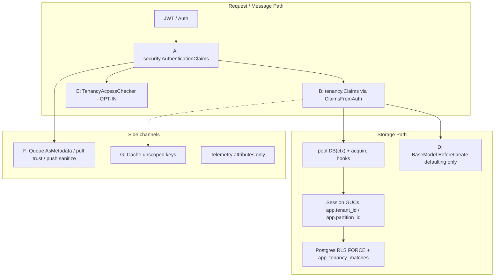
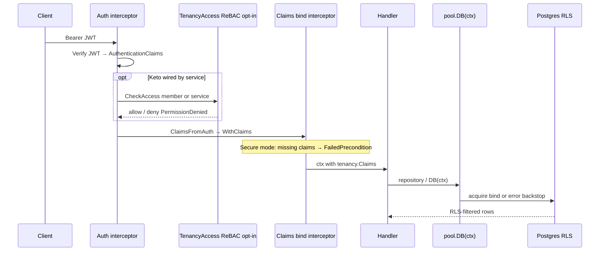
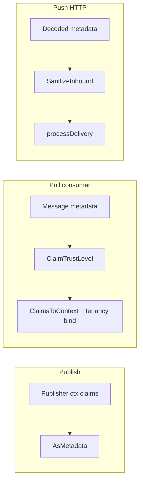
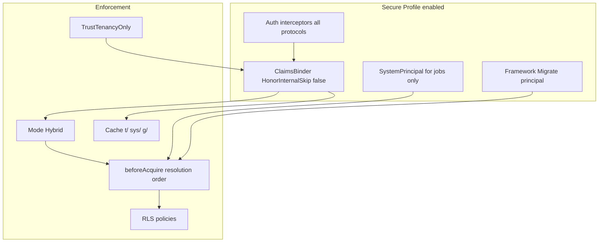
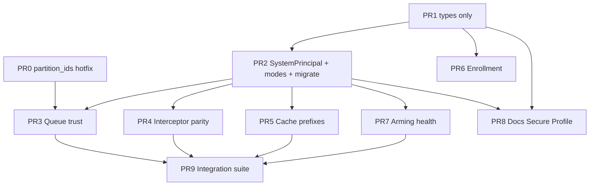

# Transparent Multi-Tenant Isolation for Frame

| Field | Value |
|-------|-------|
| **Title** | Transparent Multi-Tenant Isolation for Frame — mode-driven path to no cross-tenant leak |
| **Author** | TBD |
| **Date** | 2026-07-25 |
| **Status** | Draft (revised after design review) |
| **Repository** | github.com/pitabwire/frame/v2 (`/home/j/code/pitabwire/frame`) |
| **Related** | [Tenancy & RLS Pluggable Design](2026-05-12-tenancy-rls-pluggable-design.md) (landed); claims mapping hardening (`0fd41df`); health probes (`277b565`) |
| **Durable copy** | Prefer later under `docs/superpowers/specs/` (e.g. `2026-07-25-transparent-multi-tenant-isolation.md`) |

---

## Overview

Frame’s storage isolation is **Postgres Row-Level Security (RLS) + session GUCs**, driven by **`tenancy.Claims`** derived from authentication context. The current design is **intentionally fail-open**: missing, empty, or skipped claims leave session variables empty, and `app_tenancy_matches` treats empty GUCs as **match-all**. That makes migrations, admin scripts, and unauthenticated tooling easy—but it means a single forgotten interceptor, forged queue metadata, or internal role can expose every tenant’s rows.

This design defines a **mode-driven path** to transparent multi-tenant isolation: when a service enables the **Secure Profile** (Hybrid mode + interceptor parity + queue trust hardening + arming checks + cache prefix + no legacy internal Skip), application code that uses Frame defaults (`pool.DB(ctx)`, repositories, default interceptor chains) does not need ad-hoc `WHERE tenant_id = ?` filters or manual claim plumbing to stay storage-isolated. Stock Frame defaults remain **fail-open** for compatibility until services opt in (and until a future major may flip the default).

**What “transparent” means here:** under the Secure Profile, RLS binding and fail-closed acquire behaviour are automatic on request/worker paths that already carry claims. It does **not** mean zero-config security under today’s defaults, and it does **not** replace IdP trust or optional ReBAC for forged tenant IDs in JWTs.

Enforcement remains primarily at the storage layer (RLS); ReBAC (Keto) stays the membership/authorization plane—separate but complementary. The change is **incremental**: no big-bang rewrite.

---

## Background & Motivation

### Current architecture (verified)

Isolation is layered. Layers A–G below match the full isolation audit of main.



| Layer | Package / entry | Role today | Enforcement posture |
|-------|-----------------|------------|---------------------|
| A | `security/security_claims.go` | JWT claims; `ClaimsToContext`; `EnrichTenancyClaims` for internal headers | Auth only; `roles=internal` auto-`SkipTenancyChecksOnClaims` |
| B | `tenancy/claims.go`, `tenancy/interceptor.go` | Storage-layer claims; Connect `NewClaimsInterceptor` | Fail-open if nil/empty/Skip |
| C | `tenancy/postgres/provider.go`, `sql.go` | RLS install + acquire/release GUC bind | Empty GUC = match ALL; FORCE RLS |
| D | `data/model.go` `BaseModel.BeforeCreate` / `GenID` | Defaults `tenant_id`/`partition_id` from auth | **Not enforcement** |
| E | `security/authorizer/tenancy_permission_checker.go` + interceptors | Keto ReBAC `member` / `service` on `tenant/partition` | Fail-closed but **opt-in** |
| F | `queue/publisher.go`, `process.go`, `protocol/sanitize.go`, `push/` | Publish claims as metadata; pull reconstructs; push sanitizes unless `TrustClaims` | Pull trusts metadata (incl. `roles`); push strips claim keys by default |
| G | `cache/*` | Generic key→value | **Not tenant-scoped** |

### Documented fail-open (intentional today)

From `tenancy/postgres/sql.go` and `docs/datastore.md`:

| Context | Behaviour |
|---------|-----------|
| No / empty claims | No session scope, **no error** — all rows visible |
| `Skip=true` / `WithSkipEnforcement` | Same as missing claims (explicit bypass) |
| Claims with tenancy set | Session vars bound → RLS filters |

Relevant code:

```116:141:tenancy/postgres/provider.go
// beforeAcquire pulls tenancy.Claims from ctx.
//
//   - nil, empty, or Skip → clear session vars and return (no error,
//     no filtering — empty GUCs are match-all in app_tenancy_matches).
//   - otherwise → bind tenant + partitions so RLS filters.
func (*Provider) beforeAcquire(ctx context.Context, conn dialect.DialectConn) error {
	claims := tenancy.ClaimsFromContext(ctx)
	if claims == nil || claims.IsEmpty() || claims.Skip {
		return clearSession(ctx, conn)
	}
	// ...
}
```

```25:41:tenancy/postgres/sql.go
CREATE OR REPLACE FUNCTION app_tenancy_matches(...) RETURNS boolean AS $$
BEGIN
    RETURN (
        current_setting('app.tenant_id', true) IS NULL
        OR current_setting('app.tenant_id', true) = ''
        OR row_tenant_id = current_setting('app.tenant_id', true)
    ) AND (
        current_setting('app.partition_id', true) IS NULL
        OR current_setting('app.partition_id', true) = ''
        OR row_partition_id = ANY(string_to_array(...))
    );
END;
```

### Fail-open / leak vectors to close carefully

| # | Vector | Severity | Notes |
|---|--------|----------|-------|
| 1 | Missing claims ⇒ full table access | **Critical** (for prod request paths) | Documented intentional; breaks if forgotten claims binding |
| 2 | `roles=internal` ⇒ `Skip` RLS entirely | **Critical** | `ClaimsToContext` + `ClaimsFromAuth` both set Skip |
| 3 | JWT tenancy not verified without TenancyAccess interceptor | **High** | Anyone with a valid JWT carrying arbitrary tenant/partition IDs gets RLS for that tenant unless ReBAC is wired. **Residual under Secure Profile without Keto.** |
| 4 | Pull queue trusts claim metadata (incl. `roles=internal`) | **Critical** | `processDelivery` → `ClaimsFromMap` → `ClaimsToContext` |
| 5 | Superuser / `BYPASSRLS` bypasses RLS | **Critical** (ops) | Documented; tests use `frametests/rlstest` |
| 6 | `partition_ids` not in `IsClaimKey` strip list | **High** | Push sanitize misses multi-partition key — **PR0 hotfix** |
| 7 | Partition-only claims (empty tenant) match all tenants for those partitions | **High** | `IsEmpty` false if any partition set; GUC tenant empty = match all tenants |
| 8 | Cache cross-tenant on key collision | **High** | Same logical key, different tenants → shared entry |
| 9 | Enrollment silent skip for non-`Tenanted` models | **Medium** | Value→pointer promotion already fixed; still silent for non-Tenanted |
| 10 | `AllowGlobalUpdate: true` always on `pool.DB` | **Medium** | Relies entirely on RLS for UPDATE/DELETE safety |
| 11 | gRPC/HTTP lack default claims interceptor parity with Connect | **High** | Only Connect `DefaultList` binds tenancy claims |

Recent hardening (`0fd41df`) improved Normalize/Validate, multi-partition `AsMetadata` round-trip, and stopped queue consumers from blanket `SkipTenancyChecksOnClaims`—but internal roles still skip RLS via `IsInternalSystem`, and pull still trusts metadata.

### Why change now

1. **Transparency under Secure Profile**: product services that opt in should be storage-isolated by using Frame defaults, not by discipline.
2. **Defense in depth**: RLS is primary; ReBAC, queue trust, and cache must not undermine it.
3. **Migration realism**: many services rely on fail-open for migrations and batch jobs—modes + framework-owned migration principals keep them working.

---

## Goals & Non-Goals

### Goals

1. **Transparent isolation under Secure Profile**: when Secure Profile is enabled, using `pool.DB(ctx)`, `BaseRepository`, and default interceptor chains is sufficient for per-tenant **storage** isolation on application request paths—no manual `WHERE tenant_id` filters. (IdP-issued tenant claims remain trusted without ReBAC; see residual risks.)
2. **Security modes**: support **fail-open (legacy)**, **fail-closed (secure)**, and **hybrid** (fail-closed for ordinary contexts; match-all only with audited `SystemPrincipal`).
3. **Default secure request path (when profile enabled)**: auth → optional ReBAC tenancy access → bind `tenancy.Claims` → storage acquire binds GUCs (or errors early / at acquire).
4. **Scoped system principals**: replace ambient global RLS skip for `roles=internal` with explicit, auditable `SystemPrincipal` (scoped tenant bind or allowlisted AllowGlobal).
5. **Framework-owned migrations**: `pool.Migrate` elevates via **unexported** framework migration marker (wrap before first `DB()`); apps cannot forge elevation with `Reason: "migration"`.
6. **Queue claim trust**: never honor `roles=internal` (or Skip) from untrusted metadata under Secure Profile; document residual tenant-ID forgery risk.
7. **Cache tenant namespacing**: three distinct namespaces (`t/`, `sys/`, `g/`) when prefix enabled.
8. **Enrollment & DB role safety**: strict enrollment detection; arming check **default-on** when mode ≠ FailOpen.
9. **Binding integrity**: reject partition-only binding in secure modes; allow tenant-only (empty partitions = all partitions in tenant).
10. **Interceptor parity**: Connect, gRPC, HTTP share equivalent default chains.
11. **Incremental rollout**: feature flags / options; no forced break of existing fail-open consumers without opt-in.

### Non-Goals

- Replacing Postgres RLS as the primary storage enforcement mechanism.
- Folding ReBAC (Keto) into the database or making Keto mandatory for all services.
- Schema-per-tenant or multi-database tenancy in this design.
- Reworking `BaseModel` defaulting hooks into enforcement.
- Changing GORM repository APIs to require explicit tenant parameters.
- Supporting transaction-mode PgBouncer with session GUCs.
- Big-bang removal of fail-open without a migration window.
- Claiming that stock defaults alone eliminate all cross-tenant vectors (including forged JWT tenants and forged queue tenant IDs).

---

## Secure Profile (named configuration)

**Secure Profile** is the documented combination that achieves transparent storage isolation. It is **opt-in** until a future major version.

| Setting | Secure Profile value | Stock default (compat) |
|---------|----------------------|------------------------|
| `TenancySecurityMode` | `hybrid` | `fail_open` |
| `LegacyInternalSkip` / honor internal Skip | `false` | `true` |
| Queue pull `ClaimTrust` | `TrustTenancyOnly` | `TrustAll` |
| Push `TrustClaims` | `false` (strip claim keys, incl. `partition_ids`) | `false` |
| Cache tenant prefix | `true` | `false` |
| Enrollment strict | `true` (at least in CI) | `false` |
| Arming health check | **on** (because mode ≠ FailOpen) | off |
| Interceptor parity | Connect + gRPC + HTTP claims bind | Connect only in `DefaultList` |
| TenancyAccess (Keto) | **still opt-in** | opt-in |
| SystemPrincipal allowlist for `AllowGlobal` | configured | n/a |

**Residual risks even under Secure Profile:**

1. **JWT tenant/partition claims are trusted for RLS** unless the service also enables `TenancyAccessChecker` (ReBAC). Isolation filters *to* the claimed tenant; it does not prove membership.
2. **Queue metadata tenant IDs are not authenticated** under `TrustTenancyOnly`—only privilege escalation via `roles`/Skip is blocked. Operators must use private brokers, per-tenant topics, authenticated publishers, or `TrustNone` + static/handler bind.
3. **DB role with BYPASSRLS/superuser** still voids RLS; arming check exists to catch this on readiness.

---

## Proposed Design

### 1. Tenancy security modes

Introduce a first-class mode on the service and tenancy provider, defaulting to **legacy fail-open**.

```go
// tenancy/mode.go
package tenancy

type SecurityMode int

const (
    // ModeFailOpen preserves historical behaviour: nil/empty/Skip → no filter, no error.
    // Default for compatibility.
    ModeFailOpen SecurityMode = iota

    // ModeFailClosed rejects connection acquire when claims are missing/empty/invalid/
    // partition-only, unless an audited SystemPrincipal authorizes match-all (AllowGlobal)
    // or a scoped SystemPrincipal / normal Claims bind applies.
    ModeFailClosed

    // ModeHybrid is ModeFailClosed for ordinary request/worker contexts.
    // SystemPrincipal with AllowGlobal (allowlisted) may match-all; scoped SystemPrincipal
    // binds tenant. Recommended production target once services migrate (Secure Profile).
    ModeHybrid
)
```

#### Unified match-all / Skip rules (authoritative)

These rules apply everywhere (mode table, `beforeAcquire`, goals, system principal matrix). **No other interpretation.**

| Mode | Match-all (clearSession) allowed when | Bare `WithSkipEnforcement` (Skip claims, no SystemPrincipal) | Empty claims + SystemPrincipal (scoped TenantID) | Empty claims + SystemPrincipal AllowGlobal | Empty claims, no principal |
|------|----------------------------------------|--------------------------------------------------------------|--------------------------------------------------|--------------------------------------------|----------------------------|
| **FailOpen** | Always (nil/empty/Skip) | **Allowed** (legacy) | N/A (would clear anyway) | N/A | match-all |
| **Hybrid** | **Only** `AllowGlobal=true` **and** (framework migration marker **or** service allowlist) | **Rejected** (`ErrSkipNotPermitted`) | **Bind** principal’s tenant/partitions | match-all if authorized | **error** `ErrClaimsRequired` |
| **FailClosed** | Same as Hybrid | **Rejected** | **Bind** principal’s tenant/partitions | match-all if authorized | **error** `ErrClaimsRequired` |

**FailClosed vs Hybrid (one line):** behavioural rules for acquire are the **same** in this design; Hybrid is the *product name* for the recommended secure posture and docs/checklist branding. Both require `SystemPrincipal` for any match-all. (If a future need arises for FailClosed to also require an explicit `Claims{Skip:true}` flag in addition to SystemPrincipal, that can be added without changing Hybrid—**v1 treats them identically for Skip/match-all** to avoid implementer thrash.)

**`WithSkipEnforcement`:** remains the ergonomic API that sets `Claims{Skip:true}`. In FailOpen it alone enables match-all. In Hybrid/FailClosed it is **insufficient** without `SystemPrincipal` + `AllowGlobal` (and allowlist **or** framework migration marker). Preferred call site for **app** admin (not migrations):

```go
// ServiceName must appear on WithSystemPrincipalAllowGlobal(...).
ctx = tenancy.WithSystemPrincipal(ctx, tenancy.SystemPrincipal{
    ServiceName: "my-svc", Reason: "admin_export", AllowGlobal: true,
})
// Reason is logs/metrics only — it does NOT authorize AllowGlobal.
```

**Migrations:** never trust public `Reason: "migration"`. Use the unexported framework marker (see §1b / K14 / K17).

#### Mode table (bind outcomes)

| Mode | Missing claims | Empty claims | Partition-only (no TenantID) | Valid tenant (+ optional partitions) | Invalid IDs |
|------|----------------|--------------|------------------------------|--------------------------------------|-------------|
| FailOpen | match-all | match-all | bind partitions, tenant match-all (**unsafe**) | bind | error on validate |
| FailClosed / Hybrid | **error** unless SystemPrincipal path | same | **error** `ErrTenantIDRequired` | bind | **error** |

**Empty PartitionIDs + non-empty TenantID:** **ALLOW bind** — tenant-wide visibility (all partitions in that tenant). Documented product rule (K13). Partition GUC empty continues to match all partitions *within* the tenant filter via `app_tenancy_matches`.

#### Mode wiring (service → provider)

```text
Service.tenancySecurityMode  (default ModeFailOpen)
        │
        ├─ frame.WithTenancySecurityMode(m)
        ├─ env FRAME_TENANCY_SECURITY_MODE=fail_open|fail_closed|hybrid
        │     parsed in options_datastore / config when building service options
        │
        ▼
WithDatastore:
  if !tenancyProviderSet:
      s.tenancyProvider = tenpg.New(
          tenpg.WithSecurityMode(s.tenancySecurityMode),
          tenpg.WithAllowGlobalServices(s.allowGlobalServices...),
      )
  else:
      if p, ok := s.tenancyProvider.(tenancy.ModeAware); ok:
          p.SetSecurityMode(s.tenancySecurityMode)
      if a, ok := s.tenancyProvider.(tenancy.AllowGlobalAware); ok:
          a.SetAllowGlobalServices(s.allowGlobalServices...)
      // else: custom provider ignores mode/allowlist; log WARN
  pool.WithTenancyProvider(s.tenancyProvider)
```

```go
// tenancy package
type ModeAware interface {
    SetSecurityMode(SecurityMode)
    SecurityMode() SecurityMode
}

// AllowGlobalAware holds the service-name allowlist for AllowGlobal.
// Implemented by tenancy/postgres.Provider — no package globals (K15).
type AllowGlobalAware interface {
    SetAllowGlobalServices(names ...string)
    AllowGlobalServices() []string
}

// tenancy/postgres
func New(opts ...Option) *Provider
func WithSecurityMode(m tenancy.SecurityMode) Option
func WithAllowGlobalServices(names ...string) Option
// Provider implements ModeAware + AllowGlobalAware
// Fields: mode SecurityMode; allowGlobalServices map[string]struct{}
```

- **Per-process / service-wide** mode and allowlist (not per-pool), applied when constructing the default provider.
- **Allowlist home:** stored on the **provider** (`p.allowGlobalServices`), checked inside `beforeAcquire` via `p.allowGlobalAuthorized(sp)`—not a free function that only sees `ctx` (except the unexported framework-migration marker on ctx).
- **Custom `WithTenancyProvider(p)`:** if `p` implements `ModeAware` / `AllowGlobalAware`, service config is pushed; otherwise documented limitation.
- **Migration pool** (`DefaultMigrationPoolName`): same provider instance / same mode, but migrate entrypoints use the unexported framework marker (see §1b)—so Hybrid does not break migrations and apps cannot forge elevation.
- **Config ownership:** `FRAME_TENANCY_SECURITY_MODE` read in Frame option wiring (`options_datastore.go` / service bootstrap), not inside `tenancy.ClaimsFromAuth`. Optional mirror on config structs later; env + `WithTenancySecurityMode` are v1.

#### `beforeAcquire` resolution order (authoritative)

```go
func (p *Provider) beforeAcquire(ctx context.Context, conn dialect.DialectConn) error {
    sp, hasSP := tenancy.SystemPrincipalFromContext(ctx)
    claims := tenancy.ClaimsFromContext(ctx)

    // (1) Authorized global elevation → match-all
    //     Authorization is NOT based on sp.Reason (forgeable public string).
    if hasSP && sp.AllowGlobal {
        if p.mode != tenancy.ModeFailOpen && !p.allowGlobalAuthorized(ctx, sp) {
            return tenancy.ErrAllowGlobalDenied
        }
        return clearSession(ctx, conn)
    }

    // (2) Scoped system principal (TenantID required) → bind principal scope
    //     Prefer principal scope over ambient claims when present.
    if hasSP {
        if sp.TenantID == "" {
            return tenancy.ErrTenantIDRequired // AllowGlobal=false without TenantID
        }
        bind := (&tenancy.Claims{
            TenantID:     sp.TenantID,
            PartitionIDs: sp.PartitionIDs,
        }).Normalize()
        if err := bind.Validate(); err != nil {
            return err
        }
        return bindSession(ctx, conn, bind) // bind is normalized
    }

    // (3) Explicit Skip without SystemPrincipal
    if claims != nil && claims.Skip {
        if p.mode == tenancy.ModeFailOpen {
            return clearSession(ctx, conn)
        }
        return tenancy.ErrSkipNotPermitted
    }

    // (4) Normal claims bind (ClaimsFromContext / WithClaims already normalize)
    if claims != nil && !claims.IsEmpty() {
        claims = claims.Normalize() // defensive if caller built Claims by hand
        if p.mode != tenancy.ModeFailOpen && claims.TenantID == "" {
            return tenancy.ErrTenantIDRequired // partition-only
        }
        if err := claims.Validate(); err != nil {
            return err
        }
        // Empty PartitionIDs + non-empty TenantID: allowed (tenant-wide)
        return bindSession(ctx, conn, claims)
    }

    // (5) Missing / empty claims
    if p.mode == tenancy.ModeFailOpen {
        return clearSession(ctx, conn)
    }
    return tenancy.ErrClaimsRequired
}

// allowGlobalAuthorized is a provider method (sees p.allowGlobalServices).
// Framework migration elevation uses an unexported context marker only.
func (p *Provider) allowGlobalAuthorized(ctx context.Context, sp tenancy.SystemPrincipal) bool {
    if tenancy.IsFrameworkMigration(ctx) { // unexported marker — not Reason string
        return true
    }
    _, ok := p.allowGlobalServices[sp.ServiceName]
    return ok
}
```

**Tests required:** background job with `WithSystemPrincipal{TenantID:"t1"}` and **no** user JWT claims → only tenant `t1` rows; AllowGlobal without allowlist → denied in secure modes; bare `WithSkipEnforcement` in Hybrid → `ErrSkipNotPermitted`; **app** `WithSystemPrincipal{Reason:"migration", AllowGlobal:true}` **without** allowlist and **without** framework marker → `ErrAllowGlobalDenied`.

#### New errors (`tenancy` package)

| Error | When |
|-------|------|
| `ErrClaimsRequired` | Secure mode, no bindable claims / principal |
| `ErrTenantIDRequired` | Partition-only claims, or scoped principal without TenantID |
| `ErrSkipNotPermitted` | `Claims.Skip` without SystemPrincipal in secure modes |
| `ErrAllowGlobalDenied` | `AllowGlobal` without provider allowlist **and** without framework migration marker |

(`ErrUntrustedInternalRole` is **not** exported—queue path strips roles via trust level instead of returning a dedicated error.)

### 1b. Framework-owned migration context (critical for Hybrid)

**Problem:** `pool.Migrate` / `applyAutoMigrations` / migration executor call `DB(ctx, false)` with the caller’s context and typically **no claims** (`datastore/pool/implementation.go`). Enabling Hybrid without wrapping every migrate call fails boot.

**Decision (K14):** Frame-owned migrate paths elevate via an **unexported context marker** that application code cannot set. Public `SystemPrincipal.Reason` is **never** an authorization signal (K17).

```go
// tenancy package (same package as SystemPrincipal — unexported key)

type frameworkMigrationKey struct{} // unexported — only frame tenancy/pool can mint

// WithFrameworkMigration is not exported to apps. Used only by
// datastore/pool.Migrate and migration package internals.
// Implementation lives in package tenancy; pool calls it as:
//   ctx = tenancy.WithFrameworkMigration(ctx)  // exported only if pool is same module;
// Prefer: keep WithFrameworkMigration unexported and place a thin
// internal API: tenancy/migrateauth or //go:linkname-free same-module
// helper in tenancy that pool imports:
//
//   // tenancy/framework_migration.go
//   func WithFrameworkMigration(ctx context.Context) context.Context {
//       ctx = context.WithValue(ctx, frameworkMigrationKey{}, true)
//       ctx = WithSystemPrincipal(ctx, SystemPrincipal{
//           ServiceName: "frame",
//           Reason:      "migration", // logs/metrics only
//           AllowGlobal: true,
//       })
//       return ctx
//   }
//   func IsFrameworkMigration(ctx context.Context) bool {
//       v, _ := ctx.Value(frameworkMigrationKey{}).(bool)
//       return v
//   }
//
// Export WithFrameworkMigration only to frame internals (same module
// path github.com/pitabwire/frame/v2/...). Apps in other modules cannot
// set frameworkMigrationKey{}. Document: forging Reason:"migration"
// alone does nothing without the marker + AllowGlobal still needs
// p.allowGlobalAuthorized which requires the marker OR allowlist.
```

**`pool.Migrate` must wrap before the first acquire** (easy to get wrong):

```go
func (s *pool) Migrate(ctx context.Context, migrationsDirPath string, migrations ...any) error {
    // FIRST line after validation — before any s.DB(ctx, ...)
    ctx = tenancy.WithFrameworkMigration(ctx)
    // audited once: log system_principal reason=migration framework=true

    db := s.DB(ctx, false) // acquire sees marker + AllowGlobal
    // ...
    migrator := migration.NewMigrator(ctx, func(jobCtx context.Context) *gorm.DB {
        // Prefer outer migration ctx if jobCtx lacks marker; or always:
        return s.DB(tenancy.EnsureFrameworkMigration(jobCtx, ctx), false)
    })
    // EnsureFrameworkMigration: if jobCtx already has marker, use it;
    // else attach marker from parent migrate ctx so patch apply cannot drop elevation.
    // ...
}
```

Applies to:

- `pool.Migrate` (wrap at top; all `DB` / AutoMigrate / Install / patch apply)
- `migration.Migrator` DB factory must retain migration-scoped ctx
- `SaveMigration` if it opens connections under the same policy

**Not** applied to ordinary `pool.DB` from application handlers.

**App cannot mint framework elevation:** `WithSystemPrincipal{Reason:"migration", AllowGlobal:true}` without allowlist and without marker → `ErrAllowGlobalDenied` in secure modes.

**Docs change:** document framework-only migration elevation; app admin uses allowlisted ServiceName. Replace bare `WithSkipEnforcement` migration examples.

**Phase requirement / tests:** PR2 implements marker + wrap-before-first-DB; PR9 asserts Hybrid `Migrate` succeeds without app principal and that app-forged `Reason:"migration"` is denied.

**Export surface:** `WithFrameworkMigration` / `IsFrameworkMigration` may be package-public under `tenancy` for `datastore/pool` (same module) but **must not** be documented as app API; godoc: “For Frame internals only.” Alternatively keep unexported and put migrate wrap inside `tenancy` via a `MigrateContext(ctx) context.Context` used solely from pool—same unexported key.
### 2. Default request path

Target chain (all protocols):



**Connect today** (`security/interceptors/connect/default_set.go`):

```
otel → validation → auth → tenancy.NewClaimsInterceptor → (caller more…)
```

**Target Connect default (zero-arg preserved):**

```
otel → validation → auth → tenancy.NewClaimsInterceptor() | NewClaimsInterceptorWithBinder(b) → …
```

**Interceptor constructors (no compile break):**

```go
// Legacy zero-arg: fail-open binder (HonorInternalSkip=true, RequireClaims=false).
func NewClaimsInterceptor() connect.Interceptor {
    return NewClaimsInterceptorWithBinder(nil) // nil → default legacy ClaimsBinder
}

func NewClaimsInterceptorWithBinder(b *ClaimsBinder) connect.Interceptor
```

**`DefaultList` binder glue (PR4):**

```go
// Option A (preferred): extend signature with optional binder without breaking
// existing call sites via variadic options:
func DefaultList(
    ctx context.Context,
    authI security.Authenticator,
    opts ...DefaultListOption,
) ([]connect.Interceptor, error)

type DefaultListOption func(*defaultListConfig)
func WithClaimsBinder(b *ClaimsBinder) DefaultListOption

// Option B: frame-level helper that owns Secure Profile wiring:
//   frame.ConnectDefaultInterceptors(svc) → builds binder from svc options
//   and calls DefaultList(ctx, auth, WithClaimsBinder(svc.ClaimsBinder()))
```

Service options (`WithLegacyInternalSkip(false)`, mode Hybrid, Secure Profile) construct `*ClaimsBinder` on the service; **frame** server/bootstrap passes it into `DefaultList` / `ConnectDefaultInterceptors`. No package globals.

- **TenancyAccess:** remains **opt-in only**—**not** added to `DefaultList` automatically (K16). Services register `NewTenancyAccessInterceptor` when Keto is configured. Residual JWT tenant trust is explicit.
- **Claims interceptor:** always in defaults. When binder has `RequireClaims: true` (Secure Profile):
  - After auth, if no bindable tenancy claims → **early fail** with Connect `CodeFailedPrecondition` / gRPC `FailedPrecondition` / HTTP 400 (K18).
  - ReBAC deny remains `PermissionDenied` / 403.

**Acquire-time errors** remain the **backstop** for queues, workers, and any path without the RPC interceptor.

### 3. Internal / system principals

**Problem:** `roles=internal` currently:

1. `AuthenticationClaims.ClaimsToContext` calls `SkipTenancyChecksOnClaims`
2. `ClaimsFromAuth` sets `Skip = auth.IsInternalSystem() || IsTenancyChecksOnClaimSkipped(ctx)`
3. Provider treats Skip as match-all

#### SystemPrincipal

```go
// tenancy/system.go

type SystemPrincipal struct {
    ServiceName  string
    Reason       string   // logs/metrics ONLY — never used for authorization
    TenantID     string   // if set (and !AllowGlobal), beforeAcquire binds this scope
    PartitionIDs []string
    AllowGlobal  bool     // match-all; requires provider allowlist OR framework marker
}

func WithSystemPrincipal(ctx context.Context, p SystemPrincipal) context.Context
func SystemPrincipalFromContext(ctx context.Context) (SystemPrincipal, bool)
func IsSystemPrincipal(ctx context.Context) bool

// IsFrameworkMigration reports the unexported migration marker (§1b).
// App code cannot set the marker (unexported key).
func IsFrameworkMigration(ctx context.Context) bool

// AllowGlobal authorization is a *provider method*, not a free function:
//   p.allowGlobalAuthorized(ctx, sp) → IsFrameworkMigration(ctx) ||
//                                      sp.ServiceName ∈ p.allowGlobalServices
// Free-function AllowGlobalAuthorized(ctx, sp) is NOT part of the public API
// (it cannot see the allowlist without globals).
```

**AllowGlobal dual control (K17) — unforgeable:**

1. `SystemPrincipal.AllowGlobal == true`, **and**
2. **Either:**
   - **Unexported framework migration marker** present on ctx (`IsFrameworkMigration(ctx)`), set only by `tenancy.WithFrameworkMigration` from `pool.Migrate` / migration internals, **or**
   - `sp.ServiceName` is on the **provider** allowlist (`WithSystemPrincipalAllowGlobal` → `p.allowGlobalServices`)

**Not authorization:** `Reason == "migration"` (or any Reason string). Public Reason is for logs/metrics only. Any handler calling `WithSystemPrincipal{Reason:"migration", AllowGlobal:true}` without (2) gets `ErrAllowGlobalDenied` in secure modes.

Without (2), `beforeAcquire` returns `ErrAllowGlobalDenied` in secure modes.

#### Behaviour matrix

| API | RLS | Use case |
|-----|-----|----------|
| User JWT (no internal) | Bound to JWT tenant/partitions | Normal requests |
| Internal JWT **with** tenant/partition (or secondary via EnrichTenancyClaims) | **Bound** (no Skip under Secure Profile) | S2S on behalf of tenant |
| `WithSystemPrincipal` + TenantID, no AllowGlobal | **Bound** to principal’s tenant/partitions | Process-local job for one tenant |
| `WithSystemPrincipal` + AllowGlobal + **allowlisted** ServiceName | match-all | Admin export, rare global jobs |
| Framework Migrate (`WithFrameworkMigration` marker) | match-all (audited) | Schema migrations — **not** forgeable via Reason |
| App `Reason:"migration"` + AllowGlobal, no marker/allowlist | **ErrAllowGlobalDenied** | Attack / misuse path closed |
| Metadata `roles=internal` alone | **Ignored for Skip** under Secure Profile / TrustTenancyOnly | Prevent queue privilege escalation |
| Bare `WithSkipEnforcement` in Hybrid | **error** | Force explicit SystemPrincipal |

#### EnrichTenancyClaims vs SystemPrincipal (K19)

- **`EnrichTenancyClaims` + internal JWT** remains the **service-to-service** pattern: secondary tenant/partition on context; `ClaimsFromContext` merges for internal systems; RLS **binds** that tenant; **no Skip** under Secure Profile.
- Secondary tenancy still requires `isInternalSystem()` for the merge path (unchanged contract in `security.ClaimsFromContext`).
- **`SystemPrincipal` is for process-local jobs and migrations**, not a replacement for EnrichTenancyClaims on inbound S2S RPCs.
- Do not use SystemPrincipal to fake S2S identity on user-facing handlers.

#### ClaimsFromAuth / ClaimsToContext wiring (no package globals)

**Problem:** `ClaimsFromAuth` and `ClaimsToContext` cannot read `Provider.mode` or service options from thin air.

**Decision (K15):** explicit options on the call path; service options configure **binders and subscribers**, not process-wide mutable globals.

```go
// tenancy
type ClaimsFromAuthOption func(*claimsFromAuthConfig)

type claimsFromAuthConfig struct {
    HonorInternalSkip bool // default true for back-compat when callers pass nothing
}

func WithHonorInternalSkip(v bool) ClaimsFromAuthOption

func ClaimsFromAuth(ctx context.Context, auth *security.AuthenticationClaims, opts ...ClaimsFromAuthOption) *Claims {
    cfg := claimsFromAuthConfig{HonorInternalSkip: true} // back-compat default
    for _, o := range opts {
        o(&cfg)
    }
    // ...
    skip := false
    if cfg.HonorInternalSkip && (auth.IsInternalSystem() || security.IsTenancyChecksOnClaimSkipped(ctx)) {
        skip = true
    }
    // Secure Profile binders pass WithHonorInternalSkip(false)
    return (&Claims{...}).Normalize()
}

// BindClaims used by interceptors — constructed with options at service start
type ClaimsBinder struct {
    HonorInternalSkip bool
    RequireClaims     bool // early-fail when true (Secure Profile)
    Mode              SecurityMode
}

func (b *ClaimsBinder) Bind(ctx context.Context) (context.Context, error)
```

```go
// security
type ClaimsToContextOption func(*claimsToContextConfig)

func WithoutInternalTenancySkip() ClaimsToContextOption // HonorInternalSkip=false

func (a *AuthenticationClaims) ClaimsToContext(ctx context.Context, opts ...ClaimsToContextOption) context.Context
// Default (no opts): legacy Skip for internal (back-compat).
// Queue / Secure binders pass WithoutInternalTenancySkip().
```

**Who sets options:**

| Component | Configuration source |
|-----------|----------------------|
| Connect/gRPC/HTTP claims interceptor | `ClaimsBinder` from `frame.WithLegacyInternalSkip(false)` + mode |
| Queue `processDelivery` | Subscriber fields: `ClaimTrust`, `HonorInternalSkip bool` (default true until Secure Profile) |
| App call sites | Explicit `ClaimsFromAuth(ctx, auth, tenancy.WithHonorInternalSkip(false))` |

`WithLegacyInternalSkip(false)` on the service **does not** mutate package vars; it configures default binders/subscribers created by Frame options.

### 4. Queue claim trust model



**Principles:**

1. **Publisher** continues to attach `AsMetadata()` from trusted server context (after auth).
2. **Pull** does not treat broker metadata as fully trusted for privilege (`roles`, Skip).
3. **Tenant IDs in metadata are not a cryptographic security boundary** under `TrustTenancyOnly`—only Skip/privilege escalation is removed (K20).
4. **Push** sanitizes claim keys when `TrustClaims=false` (default)—strip list includes `partition_ids` (PR0).

**`IsClaimKey` (PR0 hotfix):**

```go
func IsClaimKey(key string) bool {
    switch key {
    case "sub", "tenant_id", "partition_id", "partition_ids",
        "profile_id", "access_id", "contact_id", "device_id",
        "roles", "service_name":
        return true
    default:
        return false
    }
}
```

**Trust policy API:**

```go
type ClaimTrustLevel int

const (
    TrustNone ClaimTrustLevel = iota // drop all claim-shaped keys (push default)
    TrustTenancyOnly                 // tenant/partition/access/sub; strip roles/service_name
    TrustAll                         // full ClaimsFromMap (legacy pull default)
)

func ApplyClaimTrust(md map[string]string, level ClaimTrustLevel) map[string]string
```

| Level | RLS bind from metadata | Honor roles→Skip | Residual threat |
|-------|------------------------|------------------|-----------------|
| TrustNone | No — handler/static must bind | No | Handler must set tenancy |
| TrustTenancyOnly | Yes (attacker-controlled IDs if broker open) | **No** | **Forged tenant_id** still possible |
| TrustAll | Yes | Yes (legacy) | Forged tenant + internal Skip |

**Pull default (K20):** remain **`TrustAll`** until a **major** version. Secure Profile uses **`TrustTenancyOnly`**. Document residual forged-tenant risk; require operator controls (private broker, per-tenant topics, authenticated publishers only, or TrustNone + subscriber static tenant / handler-side `WithClaims`).

**Optional pattern:** `TrustNone` + `WithClaims` from subscriber config for single-tenant workers.

**`processDelivery` (honorInternalSkip-aware):**

```go
md := protocol.ApplyClaimTrust(metadata, s.claimTrust)
authClaim := security.ClaimsFromMap(md)
if authClaim != nil {
    var ctcOpts []security.ClaimsToContextOption
    if !s.honorInternalSkip {
        // Secure Profile / TrustTenancyOnly subscribers: never Skip from roles=internal
        ctcOpts = append(ctcOpts, security.WithoutInternalTenancySkip())
    }
    // Legacy TrustAll + honorInternalSkip=true: omit option → internal Skip still works
    pCtx = authClaim.ClaimsToContext(pCtx, ctcOpts...)
    pCtx = util.SetTenancy(pCtx, authClaim)
    pCtx = tenancy.WithClaims(pCtx, tenancy.ClaimsFromAuth(pCtx, authClaim,
        tenancy.WithHonorInternalSkip(s.honorInternalSkip)))
}
```

### 5. Cache tenant namespacing

**Three namespaces** when prefix feature is enabled (never collapse missing-claims with explicit global).

**Authoritative prefix selection** (aligns cache isolation with storage bind — K25):

```text
if explicit WithGlobalNamespace on this cache instance:
    → g/
else if bindable TenantID available (from tenancy.Claims OR scoped SystemPrincipal.TenantID):
    → t/{sanitizedTenantID}/          // ALWAYS when TenantID set, including scoped jobs
else if SystemPrincipal present (AllowGlobal or misconfig without TenantID):
    → sys/{sanitizedServiceName}/     // incidental system/global-admin caches
else if mode is FailOpen and no claims:
    → unset/                          // not g/
else: // secure mode, no tenant, no principal
    → error (do not write)
```

| Prefix | When | Purpose |
|--------|------|---------|
| `t/{sanitizedTenantID}/` | **Any** bindable TenantID (Claims **or** scoped SystemPrincipal) | Same isolation key as RLS bind |
| `sys/{sanitizedService}/` | SystemPrincipal **and** empty TenantID (AllowGlobal admin, or pre-error misconfig) | Process-local / global-admin incidental keys |
| `g/` | **Explicit** `cache.WithGlobalNamespace()` only | JWKS, feature flags |
| `unset/` | FailOpen, missing claims, no principal | Avoid sharing `g/` |

**Rules:**

- Scoped SystemPrincipal with TenantID **always** uses `t/…`, never `sys/…`—same tenant boundary as storage.
- **AllowGlobal** incidental caches → `sys/{service}/`, **not** `g/`, unless the cache was constructed with `WithGlobalNamespace`.
- **Missing claims in Hybrid/FailClosed:** DB acquire fails; cache ops should fail or no-op with error—do not write to `g/`.
- **Sanitize** tenant/service segments: reject empty; reject `/`, `\0`; max length 64; optionally percent-encode. Invalid segment → error, do not write.
- **Default:** prefix **off** until Secure Profile (K21).
- **Granularity:** **tenant-only** prefix (not partition) for hit rate (K21). Within-tenant cross-partition share is accepted; products needing partition isolation use partition in the app key.
- **Flush** remains store-wide; document cross-tenant effect.

```go
func TenantKeyPrefix(ctx context.Context) (string, error)
func NewTenantAwareCache[K comparable, V any](raw RawCache, keyFunc func(K) string, opts ...TenantCacheOption) Cache[K, V]
func WithGlobalNamespace() TenantCacheOption // forces g/ for this cache instance
```

### 6. Enrollment safety & BYPASSRLS detection

#### Enrollment strict detection (precise)

Strict mode fails migrate when **any** of the following holds for a model in the migrate list, and the model is not `Unscoped`:

1. Model (after `asPointer`) does **not** implement `tenancy.Tenanted`, **and**
2. Reflect on exported fields: has field named `TenantID` **or** struct tag `gorm:"..."` containing column `tenant_id` (case-insensitive column name), **or** embeds a type named `BaseModel` (duck-type by name `BaseModel` in anonymous embed chain).

Unscoped (`tenancy.Unscoped` / `UnscopedMarker`) always exempt.

Non-strict: INFO log enrolled tables; WARN for models matching (2) but not Tenanted.

#### BYPASSRLS / arming check

```go
type ArmingChecker struct { /* db ping + role flags + provider non-nil */ }
func (c *ArmingChecker) Name() string { return "tenancy_provider_armed" }
```

**Default-on when `SecurityMode != ModeFailOpen`** (K22). Opt-out: `WithTenancyArmingCheck(false)`. FailOpen: default off; opt-in for staging.

Checks: provider non-nil; `rolsuper` and `rolbypassrls` false for `current_user` on **app** pool (not migration superuser pool).

### 7. Require TenantID for binding

In Hybrid/FailClosed:

- Reject partition-only (`TenantID == ""` with partitions) → `ErrTenantIDRequired`.
- **Allow** `TenantID != ""` with empty `PartitionIDs` (tenant-wide) — K13.

Folded into PR2 mode branches (not a separate late PR).

### 8. Interceptor parity (Connect / gRPC / HTTP)

| Capability | Connect | gRPC | HTTP |
|------------|---------|------|------|
| Auth | `DefaultList` | `UnaryAuthInterceptor` | `AuthenticationMiddleware` |
| Tenancy claims bind | `NewClaimsInterceptor` in `DefaultList` | **Add** default helper | **Add** default helper |
| TenancyAccess (ReBAC) | **opt-in** | **opt-in** | **opt-in** |

Shared `tenancy.ClaimsBinder.Bind` / `BindClaims`. Protocol wrappers map early-fail to FailedPrecondition (secure) vs pass-through (fail-open).

### 9. Health / readiness

| Check | Endpoint | When |
|-------|----------|------|
| Tenancy provider configured | `/readyz` | Datastore enabled |
| Not superuser / not BYPASSRLS | `/readyz` | **Default when mode ≠ FailOpen** |
| RLS policies present | optional | Staging |

Never on `/livez`.

### 10. `AllowGlobalUpdate` (K12)

Retain `AllowGlobalUpdate: true`. Safety net = FORCE RLS + non-BYPASSRLS role + Secure Profile arming. No production GORM callback change. Optional: test-only assertion helpers in `frametests` that fail if a query updates zero WHERE under a mock—non-blocking for v1.

### End-to-end Secure Profile path



---

## API / Interface Changes

### New / extended public APIs

```go
// tenancy
type SecurityMode int // ModeFailOpen, ModeFailClosed, ModeHybrid

type ModeAware interface {
    SetSecurityMode(SecurityMode)
    SecurityMode() SecurityMode
}

var (
    ErrClaimsRequired     = errors.New("tenancy: claims required")
    ErrTenantIDRequired   = errors.New("tenancy: tenant id required for binding")
    ErrSkipNotPermitted   = errors.New("tenancy: skip not permitted without system principal")
    ErrAllowGlobalDenied  = errors.New("tenancy: AllowGlobal not authorized for this service")
)

func (c *Claims) IsBindable() bool
func ClaimsFromAuth(ctx context.Context, auth *security.AuthenticationClaims, opts ...ClaimsFromAuthOption) *Claims
func WithHonorInternalSkip(bool) ClaimsFromAuthOption

type SystemPrincipal struct { /* ... */ }
func WithSystemPrincipal(ctx context.Context, p SystemPrincipal) context.Context
func SystemPrincipalFromContext(ctx context.Context) (SystemPrincipal, bool)
func IsSystemPrincipal(ctx context.Context) bool

type ClaimsBinder struct {
    HonorInternalSkip bool
    RequireClaims     bool
    Mode              SecurityMode
}
func (b *ClaimsBinder) Bind(ctx context.Context) (context.Context, error)

// Zero-arg preserved (legacy fail-open binder). Secure Profile uses WithBinder.
func NewClaimsInterceptor() connect.Interceptor
func NewClaimsInterceptorWithBinder(b *ClaimsBinder) connect.Interceptor
func UnaryClaimsInterceptor(b *ClaimsBinder) grpc.UnaryServerInterceptor // nil b = legacy
func StreamClaimsInterceptor(b *ClaimsBinder) grpc.StreamServerInterceptor
func ClaimsMiddleware(b *ClaimsBinder) func(http.Handler) http.Handler

// Internals-only elevation (godoc: Frame migrate paths; not an app API).
func WithFrameworkMigration(ctx context.Context) context.Context
func IsFrameworkMigration(ctx context.Context) bool
```

```go
// frame
func WithTenancySecurityMode(m tenancy.SecurityMode) Option
func WithLegacyInternalSkip(bool) Option // configures binders/subscribers only
func WithSystemPrincipalAllowGlobal(serviceNames ...string) Option // → provider allowlist
func WithTenancyEnrollmentStrict(bool) Option
func WithTenancyArmingCheck(bool) Option // default true when mode ≠ FailOpen
func (s *Service) ClaimsBinder() *tenancy.ClaimsBinder // built from service options
```

```go
// security/interceptors/connect
func DefaultList(ctx context.Context, authI security.Authenticator, opts ...DefaultListOption) ([]connect.Interceptor, error)
func WithClaimsBinder(b *tenancy.ClaimsBinder) DefaultListOption
// or frame.ConnectDefaultInterceptors(svc) that injects svc.ClaimsBinder()
```

```go
// tenancy/postgres
func New(opts ...Option) *Provider
func WithSecurityMode(m tenancy.SecurityMode) Option
func WithAllowGlobalServices(names ...string) Option
// Provider: ModeAware + AllowGlobalAware; allowGlobalAuthorized method
// rlstest.New(opts ...tenpg.Option) forwards to inner provider
```

```go
// security
func WithoutInternalTenancySkip() ClaimsToContextOption
func (a *AuthenticationClaims) ClaimsToContext(ctx context.Context, opts ...ClaimsToContextOption) context.Context
```

```go
// queue / protocol
// IsClaimKey includes partition_ids (PR0)
type ClaimTrustLevel int // TrustNone, TrustTenancyOnly, TrustAll
func ApplyClaimTrust(md map[string]string, level ClaimTrustLevel) map[string]string
// Subscriber option: WithClaimTrust(level); WithHonorInternalSkip(bool)
```

```go
// cache
func NewTenantAwareCache[K comparable, V any](...) Cache[K, V]
func WithGlobalNamespace() TenantCacheOption
```

### Behavioural changes (compat)

| Change | FailOpen (stock default) | Secure Profile (Hybrid + flags) |
|--------|--------------------------|----------------------------------|
| Missing claims on DB acquire | match-all | error (except migrate principal) |
| `roles=internal` auto Skip | yes (legacy binders) | no |
| Queue pull trust | TrustAll | TrustTenancyOnly (residual tenant forgery) |
| Partition-only claims | bind (unsafe) | error |
| Bare WithSkipEnforcement | match-all | error without SystemPrincipal |
| Cache keys | unchanged | `t/` / `sys/` / `g/` when enabled |
| Framework Migrate | no principal today | unexported framework migration marker + AllowGlobal |

### Error surface (K18)

| Condition | Connect | gRPC | HTTP |
|-----------|---------|------|------|
| Missing claims after auth (RequireClaims) | `CodeFailedPrecondition` | `FailedPrecondition` | 400 |
| ReBAC TenancyAccess deny | `CodePermissionDenied` | `PermissionDenied` | 403 |
| Acquire `ErrClaimsRequired` (worker/queue) | n/a — log + fail job | n/a | n/a |
| `ErrAllowGlobalDenied` | FailedPrecondition / internal | same | 400/500 |

---

## Data Model Changes

### Database

- No application schema changes.
- SQL `app_tenancy_matches` **unchanged** (empty GUC = match-all for authorized global principal sessions).
- RLS policy name unchanged; Install idempotent.

### Context / config

- System principal context key; ClaimsBinder options; service fields for mode, allowlist, legacy skip.
- Cache key space changes when prefix enabled (cold cache).

### Migrations

- Framework attaches migration SystemPrincipal; no app SQL required.
- Operator: non-superuser app role before Hybrid (arming check).

---

## Alternatives Considered

### Alternative 1: Application-level GORM scopes only (no RLS)

| Pros | Cons |
|------|------|
| DB-role independent | Easy to forget on raw SQL |
| | Two sources of truth with RLS |

**Decision:** Reject. Keep RLS primary (aligned with 2026-05-12 design).

### Alternative 2: Fail-closed only at SQL (deny empty GUCs)

| Pros | Cons |
|------|------|
| Strong DB default | Breaks Skip/global principal and gradual rollout |

**Decision:** Reject as sole mechanism; enforce in Go acquire + modes.

### Alternative 3: Mandatory TenancyAccess (Keto) for all services

| Pros | Cons |
|------|------|
| Stops forged tenant JWTs | Couples isolation to Keto availability |

**Decision:** ReBAC stays **opt-in** (K16). Document residual IdP trust.

### Alternative 4: Schema-per-tenant

**Decision:** Non-goal.

### Alternative 5: Big-bang flip default to Hybrid

**Decision:** Reject. Stock default FailOpen; Secure Profile opt-in; future major may flip.

### Alternative 6: Migration pool always ModeFailOpen

| Pros | Cons |
|------|------|
| Simple | Two modes to reason about; app code calling migrate helpers inconsistently |

**Decision:** Prefer single mode + framework SystemPrincipal on migrate (K14) over dual mode pools.

---

## Security & Privacy Considerations

### Threat model (selected)

| Threat | Mitigation |
|--------|------------|
| Authenticated user sets JWT `tenant_id` to another tenant | **Residual** without ReBAC; enable TenancyAccess; trusted IdP issuance |
| Forged queue message with `roles=internal` | TrustTenancyOnly / WithoutInternalTenancySkip; PR0 strip keys |
| App forges `SystemPrincipal{Reason:"migration", AllowGlobal:true}` | Unexported framework marker required; Reason ignored for authz (K17) |
| Forged queue `tenant_id` | **Accepted residual** under TrustTenancyOnly; operator broker controls; TrustNone + static bind |
| Missing claims interceptor on gRPC | Default chains + fail-closed acquire + early FailedPrecondition |
| Cache shared key | `t/` / `sys/` / `g/` separation; sanitize segments |
| Superuser DB role | Arming readiness default-on in secure modes |
| Abuse of AllowGlobal | Provider allowlist; framework elevation only via unexported marker (not Reason) |
| Cross-tenant partition-only claims | ErrTenantIDRequired in secure modes |
| Push claim injection | SanitizeInbound + `partition_ids` in IsClaimKey |

### AuthN vs AuthZ vs isolation

- **AuthN:** JWT validity  
- **AuthZ (membership):** Keto TenancyAccess — **opt-in**  
- **Isolation (storage):** RLS + claims / SystemPrincipal bind  

---

## Observability

### Logging

| Event | Level | Fields |
|-------|-------|--------|
| System principal used | Info | service, reason, allow_global, tenant_id |
| Framework migration principal | Info | once per Migrate |
| Acquire rejected | Warn | mode, err |
| AllowGlobal denied | Warn | service |
| Queue trust stripped roles | Debug | ref |
| Enrollment strict fail | Error | model, table |
| BYPASSRLS detected | Error | role |

### Metrics

- `frame.tenancy.bind{result=ok|missing|invalid|skip|system_scoped|system_global}`
- `frame.tenancy.system_principal{reason}`
- `frame.tenancy.acquire_denied{reason}`
- `frame.queue.claim_trust{level}`

### Alerting

- Spike `acquire_denied` after deploy  
- `tenancy_provider_armed` failing on `/readyz`  
- Production rolsuper / rolbypassrls  

---

## Rollout Plan

### Phase 0 — Hotfix + scaffolding types

- **PR0:** `partition_ids` in `IsClaimKey` (behaviour fix for push sanitize).
- **PR1:** types/errors/`IsBindable`/options/service field/`ModeAware`/docs—**provider still fail-open only** (no mode branch behaviour yet).

### Phase 1 — System principal + mode branches + migrations

- **PR2:** SystemPrincipal, AllowGlobal allowlist, `beforeAcquire` resolution order, framework Migrate wrap, partition-only reject, ClaimsFromAuth/ClaimsToContext **options**, ClaimsBinder. Hybrid usable safely.
- Queue TrustTenancyOnly **opt-in**; gRPC/HTTP claims interceptors; cache prefix opt-in; enrollment strict opt-in; arming default-on for non-FailOpen.

### Phase 2 — Secure Profile pilot

- 1–2 services enable full Secure Profile.
- Validate migrations, workers, metrics.

### Phase 3 — Broad adoption

- Blueprints document Secure Profile (after pilots—K11).
- Checklist-driven migration.

### Phase 4 — (Future major) default Hybrid

- Stock default becomes Hybrid; FailOpen remains available.

### Per-service Secure Profile checklist

1. App DB role: non-superuser, no BYPASSRLS (arming will enforce on ready).
2. Interceptor parity (use default chains).
3. Optionally enable TenancyAccess if Keto available (closes JWT tenant forgery).
4. Queue `TrustTenancyOnly` + operator broker controls.
5. `WithLegacyInternalSkip(false)`; S2S uses EnrichTenancyClaims; jobs use SystemPrincipal.
6. Cache prefix on; register JWKS/flags with `WithGlobalNamespace`.
7. `ModeHybrid`; load test; watch `acquire_denied`.

### Rollback

- `FRAME_TENANCY_SECURITY_MODE=fail_open`
- Re-enable legacy internal skip on binders
- Queue trust back to TrustAll
- Disable cache prefix (flush)

### Feature flags summary

| Flag / option | Stock default | Secure Profile |
|---------------|---------------|----------------|
| `TenancySecurityMode` | fail_open | hybrid |
| `LegacyInternalSkip` (binders) | true | false |
| Queue `ClaimTrust` | TrustAll | TrustTenancyOnly |
| Push claim strip | true (TrustClaims false) | true + partition_ids |
| Cache tenant prefix | false | true |
| Enrollment strict | false | true (CI) |
| Arming health check | false | **true** (auto with mode) |
| TenancyAccess in DefaultList | never | never (still opt-in) |

---

## Open Questions

Resolved items moved to **Key Decisions**. Remaining (non-blocking):

1. ~~Empty PartitionIDs~~ → **K13**
2. ~~Pull TrustTenancyOnly default timing~~ → **K20**
3. ~~Auto TenancyAccess in DefaultList~~ → **K16**
4. ~~AllowGlobal dual control~~ → **K17**
5. **Multi-partition ReBAC gap:** `TenancyAccessChecker` checks **primary** `GetPartitionID()` only while RLS may bind multiple partitions. **Decision for v1 (K23):** document as known gap—membership plane validates primary partition only; multi-partition expansion via `WithExtraPartitions` is a privileged storage concern. Follow-up RFC may check all IDs (N Keto calls / batch).
6. ~~Cache tenant vs partition~~ → **K21**
7. ~~Error code mapping~~ → **K18**
8. **Blueprint Hybrid timing:** after ≥1 pilot service validates Secure Profile in staging (operational gate, not API blocker).

---

## Key Decisions

| # | Decision | Rationale |
|---|----------|-----------|
| K1 | **Postgres RLS + session GUCs remain primary isolation** | Shipped, transparent to repos; pluggable provider |
| K2 | **Security modes; stock default fail-open** | Compatibility; Secure Profile is opt-in |
| K3 | **Fail-closed in Go acquire hook; SQL match-all unchanged** | Explicit global principal sessions still work |
| K4 | **`roles=internal` must not imply RLS Skip under Secure Profile** | Privilege escalation; options-based ClaimsFromAuth/ClaimsToContext |
| K5 | **ReBAC stays separate** | Membership ≠ isolation |
| K6 | **Queue TrustTenancyOnly blocks Skip/roles, not tenant authenticity** | Honest residual risk; operator controls |
| K7 | **Require TenantID for bind in secure modes** | Partition-only crosses tenants |
| K8 | **Cache three namespaces `t/` `sys/` `g/`; opt-in until Secure Profile** | Avoid collapsing unscoped + global |
| K9 | **Interceptor parity via ClaimsBinder** | Close gRPC/HTTP gap |
| K10 | **Arming check default-on when mode ≠ FailOpen** | Catch BYPASSRLS before traffic |
| K11 | **Blueprints lag pilots** | Validate Secure Profile before scaffolds force it |
| K12 | **`AllowGlobalUpdate: true` retained** | Bulk ops; RLS + arming are backstop |
| K13 | **Empty PartitionIDs + TenantID ⇒ allow (tenant-wide)** | Operator/analyst UX; SQL already matches all partitions in tenant |
| K14 | **Framework Migrate elevates via unexported context marker + SystemPrincipal AllowGlobal; wrap before first `DB()`; migrator retains marker** | Hybrid must not break boot; elevation unforgeable by apps |
| K15 | **No package globals for mode/legacy skip/allowlist; provider fields + binder/subscriber config** | Clean architecture; queue-safe |
| K16 | **TenancyAccessChecker stays opt-in (not DefaultList)** | No Keto availability coupling; document JWT residual trust |
| K17 | **AllowGlobal authorized only by (a) unexported framework migration marker or (b) provider service allowlist — never by Reason string** | Public Reason is forgeable; marker is not |
| K18 | **Early fail: FailedPrecondition for missing claims; PermissionDenied for ReBAC** | Clear RPC contracts; acquire is backstop |
| K19 | **EnrichTenancyClaims remains S2S pattern; SystemPrincipal for jobs/migrations** | Do not conflate process elevation with S2S |
| K20 | **Pull default TrustAll until major; Secure Profile uses TrustTenancyOnly** | Compat; roles hardening is opt-in profile |
| K21 | **Cache prefix tenant-only (not partition); default off** | Hit rate; partition in app key if needed |
| K22 | **Arming readiness auto-enabled for Hybrid/FailClosed** | Hard gate for secure modes |
| K23 | **v1 ReBAC = primary partition only; document multi-partition gap** | Avoid N checks without RFC |
| K24 | **Unified Skip rule: secure modes require SystemPrincipal for match-all; bare WithSkipEnforcement is FailOpen-only** | Single implementable matrix |
| K25 | **beforeAcquire binds scoped SystemPrincipal TenantID (not only boolean escape)** | Jobs on behalf of one tenant |
| K26 | **Mode wiring: service field + tenpg.WithSecurityMode; ModeAware for custom providers** | Predictable construction |
| K27 | **PR0 partition_ids hotfix; PR1 types only; PR2 SystemPrincipal + mode branches + partition-only + migrate wrap** | Fail-closed never ships without escape hatches |
| K28 | **Secure Profile names the opt-in combo; “transparent isolation” applies when enabled** | Honest marketing vs stock defaults |
| K29 | **Allowlist lives on provider (`AllowGlobalAware`); `p.allowGlobalAuthorized(ctx, sp)` in beforeAcquire** | No free function without config; no package globals |
| K30 | **`NewClaimsInterceptor()` zero-arg preserved; `NewClaimsInterceptorWithBinder` + `DefaultList` options / frame helper inject Secure Profile binder** | No compile break; DefaultList glue explicit |
| K31 | **Cache: bindable TenantID (Claims or scoped principal) always → `t/`; `sys/` only when principal has empty TenantID; `g/` only explicit global** | Align cache isolation with storage bind (K25) |

---

## PR Plan

### PR0 — Hotfix: strip `partition_ids` on untrusted push metadata

| Field | Content |
|-------|---------|
| **Title** | `queue: include partition_ids in IsClaimKey sanitize list` |
| **Files** | `queue/protocol/sanitize.go`, `queue/protocol/sanitize_test.go` |
| **Deps** | None |
| **Description** | One-line security fix + tests. Independent of TrustLevel API. Ship immediately. |

### PR1 — Types, errors, options, ModeAware (no behaviour change)

| Field | Content |
|-------|---------|
| **Title** | `tenancy: SecurityMode types, errors, IsBindable, service wiring (still fail-open)` |
| **Files** | `tenancy/mode.go`, `tenancy/errors.go`, `tenancy/claims.go` (+ IsBindable), `tenancy/claims_test.go`, `options_datastore.go` (service field + env parse + `tenpg.New(WithSecurityMode)` when default provider), `tenancy/postgres/options.go` (store mode, **do not branch yet**), `docs/datastore.md` (mode preview) |
| **Deps** | None (PR0 parallel) |
| **Description** | Add types and wire mode onto provider struct / ModeAware. **`beforeAcquire` remains fail-open.** Custom providers: ModeAware documented. `rlstest.New(opts ...tenpg.Option)` signature forward-compatible. |

### PR2 — SystemPrincipal + mode branches + migrate wrap + partition-only

| Field | Content |
|-------|---------|
| **Title** | `tenancy: SystemPrincipal, secure beforeAcquire, unforgeable framework migration marker` |
| **Files** | `tenancy/system.go`, `tenancy/framework_migration.go` (marker), `tenancy/postgres/provider.go` (+ allowlist field, normalize-then-bind), `datastore/pool/implementation.go` (Migrate: wrap **before first DB**, migrator factory retains marker), migration executor, `tenancy/claims.go` (ClaimsFromAuth options), `security/security_claims.go` (ClaimsToContext options), `options_datastore.go` (allowlist → provider), tests: scoped principal, forged Reason denied, Hybrid Migrate succeeds, `docs/datastore.md` |
| **Deps** | PR1 |
| **Description** | Authoritative resolution order; `p.allowGlobalAuthorized` (marker \|\| allowlist); never authorize on Reason; fold TenantID-required; Normalize before bindSession. Hybrid usable. ClaimsBinder early-fail optional. **No fail-closed without this PR.** |

### PR3 — Queue ClaimTrustLevel + secure processDelivery

| Field | Content |
|-------|---------|
| **Title** | `queue: ClaimTrustLevel; TrustTenancyOnly opt-in; bind tenancy without internal Skip` |
| **Files** | `queue/protocol/sanitize.go` (ApplyClaimTrust), tests, `queue/process.go`, subscriber options, `docs/queue.md` |
| **Deps** | PR2 (ClaimsToContext options); PR0 already shipped strip list |
| **Description** | Pull default remains TrustAll. Secure Profile documents TrustTenancyOnly. Residual tenant forgery documented. |

### PR4 — Interceptor parity gRPC/HTTP + ClaimsBinder in DefaultList

| Field | Content |
|-------|---------|
| **Title** | `tenancy: ClaimsBinder; gRPC/HTTP claims interceptors; DefaultList binder options` |
| **Files** | `tenancy/interceptor.go` (keep zero-arg `NewClaimsInterceptor`, add `WithBinder`), `interceptor_grpc.go`, `interceptor_http.go`, `connect/default_set.go` (`DefaultListOption` / `WithClaimsBinder`), optional `frame.ConnectDefaultInterceptors`, examples, tests |
| **Deps** | PR1 (types); PR2 for RequireClaims/FailedPrecondition mapping |
| **Description** | Zero-arg API unbroken; Secure Profile injects binder via DefaultList options or frame helper; FailedPrecondition when RequireClaims; TenancyAccess **not** auto-added. |

### PR5 — Cache three-namespace tenant prefix

| Field | Content |
|-------|---------|
| **Title** | `cache: tenant-aware prefixes t/ sys/ g/ with sanitization` |
| **Files** | `cache/tenancy.go`, options, tests, `docs/cache.md` |
| **Deps** | None strictly; SystemPrincipal awareness better after PR2 |
| **Description** | Default off; Secure Profile on. WithGlobalNamespace for shared lookups. |

### PR6 — Enrollment strict + migrate reporting

| Field | Content |
|-------|---------|
| **Title** | `tenancy/datastore: enrollment report and strict struct/tag detection` |
| **Files** | `tenancy/enrollment.go`, `datastore/pool/implementation.go`, options, tests |
| **Deps** | PR1 optional |
| **Description** | Precise detection rules as §6; WARN/ERROR logs. |

### PR7 — Arming health check

| Field | Content |
|-------|---------|
| **Title** | `tenancy/postgres: readiness arming check; auto-on when mode ≠ fail_open` |
| **Files** | `tenancy/postgres/health.go`, service wiring, tests, docs |
| **Deps** | PR1–PR2 |
| **Description** | `/readyz` only; app pool role flags. |

### PR8 — Docs, Secure Profile guide, durable spec copy

| Field | Content |
|-------|---------|
| **Title** | `docs: Secure Profile migration guide and tenancy isolation spec` |
| **Files** | `docs/datastore.md`, security/queue/cache docs, `docs/superpowers/specs/2026-07-25-transparent-multi-tenant-isolation.md` |
| **Deps** | Can draft from PR1 parallel; finalize after PR2–PR4 APIs stable |
| **Description** | Secure Profile table, residual risks, checklist. Blueprints **not** forced Hybrid yet (K11). |

### PR9 — Integration suite + rlstest Hybrid

| Field | Content |
|-------|---------|
| **Title** | `frametests: isolation suite (Hybrid, queue trust, cache, migrate principal)` |
| **Files** | `frametests/rlstest/*` (forward tenpg options), new isolation tests |
| **Deps** | PR2–PR5, PR7 |
| **Description** | Two-tenant no cross-read; forged internal role; scoped SystemPrincipal; migrate under Hybrid; cache namespaces. |

### Dependency graph



---

## Risks

| Risk | Severity | Mitigation |
|------|----------|------------|
| **Hybrid without migrate principal breaks boot** | **Critical** | K14 wrap before first DB + migrator ctx; test in PR9 |
| **App forges Reason:migration for AllowGlobal** | **Critical** | K17 unexported marker only; test forged Reason denied |
| Services enable Hybrid before workers updated | High | Clear errors; checklist; default fail-open |
| Internal services rely on Skip | High | Legacy binders; EnrichTenancyClaims for S2S |
| TrustTenancyOnly forged tenant_id | High | Document; broker controls; optional TrustNone |
| AllowGlobal abuse | Medium | Provider allowlist K17/K29 |
| Cache prefix cold-start | Low | Enable off-peak |
| Multi-partition ReBAC gap | Medium | K23 document |
| Custom provider ignores mode | Medium | ModeAware + WARN |
| AllowGlobalUpdate in FailOpen | Medium | K12; arming when secure |

---

## References

- In-repo design: `docs/superpowers/specs/2026-05-12-tenancy-rls-pluggable-design.md`
- Datastore / tenancy docs: `docs/datastore.md`
- Security docs: `docs/security-authentication.md`, `docs/security-authorization.md`, `docs/security-interceptors.md`
- Queue docs: `docs/queue.md`
- Core code:
  - `tenancy/claims.go`, `tenancy/provider.go`, `tenancy/interceptor.go`, `tenancy/enrollment.go`
  - `tenancy/postgres/provider.go`, `tenancy/postgres/sql.go`
  - `security/security_claims.go`, `security/authorizer/tenancy_permission_checker.go`
  - `security/interceptors/connect/default_set.go`, `tenancy_access.go`
  - `security/interceptors/grpc/*`, `security/interceptors/httptor/*`
  - `datastore/pool/implementation.go`
  - `data/model.go`
  - `queue/process.go`, `queue/publisher.go`, `queue/protocol/sanitize.go`, `queue/push/handler.go`
  - `cache/cache.go`
  - `frametests/rlstest/rlstest.go`
  - `service_health.go`
  - `options_datastore.go`
- Recent commits: claims hardening `0fd41df`; health probes `277b565`
- Postgres RLS: [PostgreSQL Row Security Policies](https://www.postgresql.org/docs/current/ddl-rowsecurity.html)

---

*End of design document (revised). Primary path: `/tmp/grok-1000/grok-design-doc-f0f0e4d4.md`. Durable copy may later live at `docs/superpowers/specs/2026-07-25-transparent-multi-tenant-isolation.md`.*
